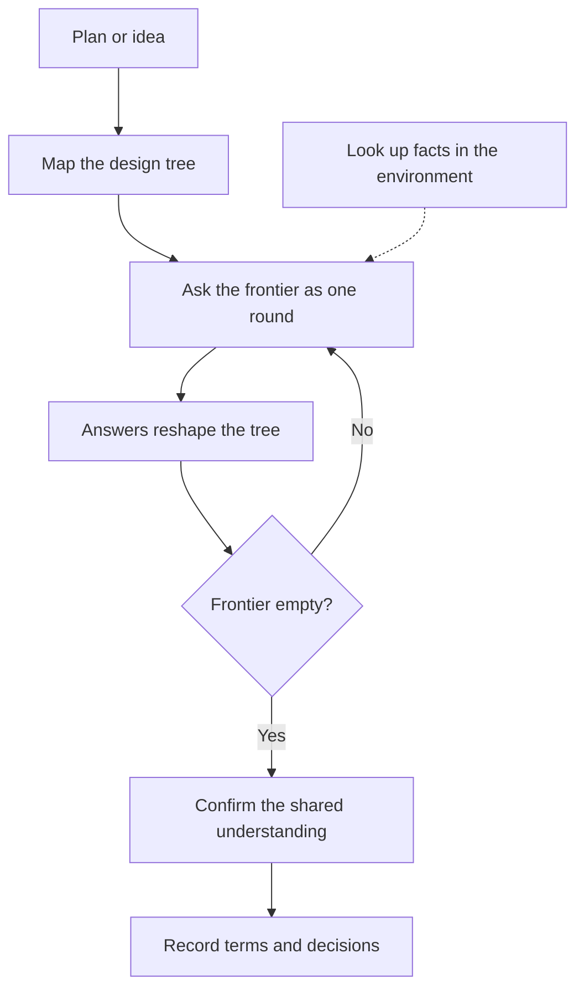

# Grill Me

Interview a plan, decision, or idea in rounds until every decision is settled.

## What It Does



| Phase | What Happens | Output |
|-------|-------------|--------|
| Map and round | Break the plan into a design tree and ask every decision whose prerequisites are settled | Questions |
| Ask | Use the harness question tool, four questions per call at most, recommended answer first; a numbered list in chat without the tool | Answers |
| Facts | Look up what the environment can answer instead of asking | Facts for later rounds |
| Close and record | Confirm the shared understanding, then write resolved terms to the glossary and qualifying decisions to ADRs | Updated records |

## Usage

```text
grill me on this plan
grill this architecture before we write the document
stress-test my idea for the export feature
ask me questions until we agree on the export feature
resolve the open decisions before the spec
```

## Output

The interview writes nothing while it runs. After the confirmation, resolved terms go to the glossary and qualifying decisions go to ADRs.

## Requirements

Uses the harness question tool when available and falls back to a numbered list in chat. Recording needs the glossary and documentation skills installed; the harness reports a missing one.

## FAQ

**Q: How is this different from brainstorming?** A: Brainstorming generates and compares alternatives. Grilling takes a plan as given and settles each decision in it.

**Q: What if a question has no fixed options?** A: It is asked in chat, alone, instead of through the question tool.

## Credits

Inspired by Matt Pocock's [grilling](https://github.com/mattpocock/skills/blob/main/skills/productivity/grilling/SKILL.md) skill.
