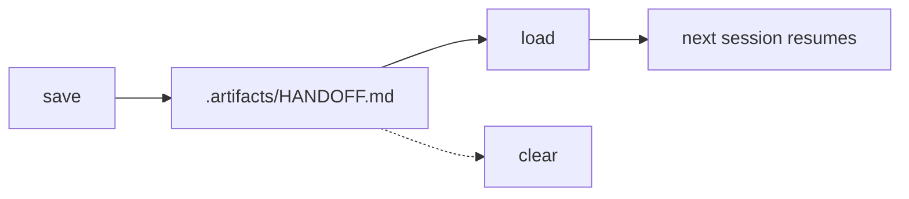

# Handoff

Capture conversation state so another session can resume.

## What It Does



| Op | Output |
|----|--------|
| save | New snapshot prepended at the top of `.artifacts/HANDOFF.md` |
| load | Latest snapshot folded into the current session's working context |
| clear | File overwritten with empty content (opt-in, separate op) |

## Usage

```
save context
dump conversation
checkpoint this
session handoff
save handoff

resume session
load handoff
continue from last

clear handoff
reset handoff
```

## Output

`.artifacts/HANDOFF.md` — newest snapshot at the top.

Two sections are always present (`Focus`, `Next step`); five are optional and omitted when empty:

```markdown
# Handoff

## YYYY-MM-DD HH:MM — {title}

**Focus:** {one line}

**Next step:** {concrete entry point}

**Decisions:**
- ...

**Findings:**
- ...

**Open threads:**
- ...

**Blockers:**
- ...

**References:**
- ...
```

## FAQ

**Q: Does save overwrite the previous snapshot?**

A: No. Each save prepends a new dated block at the top. Older snapshots are preserved.

**Q: Does load auto-clear?**

A: No. Load reads, clear is a separate explicit op.

**Q: What if the file is absent?**

A: Load and clear no-op silently. Save creates the file.

**Q: How does this differ from end-of-session note persistence?**

A: End-of-session flows write a narrative of what happened into memory systems (auto-memory, Basic Memory, Obsidian). The handoff skill is an ephemeral conversation handoff for resuming across sessions — it carries focus and next step rather than a session narrative. End-of-session flows may read the latest handoff snapshot to compose their notes; whether they clear it afterwards is up to that flow.

**Q: Can I describe what the next session should focus on?**

A: Yes. Pass the focus as an argument: `/handoff continue auth race fix`. Save tailors `Focus` and `Next step` to that focus. Without an argument, save captures generic state.
