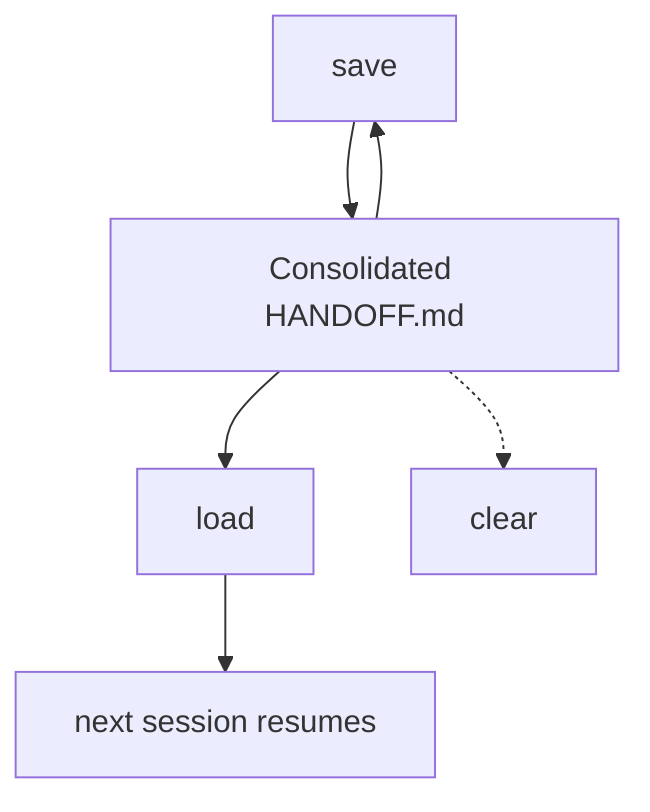

# Handoff

Capture conversation state so another session can resume.

## What It Does


```mermaid
flowchart TD
    A[save] --> B[Consolidated HANDOFF.md]
    B --> A
    B --> C[load]
    C --> D[next session resumes]
    B -.-> E[clear]
```

| Op | Output |
|----|--------|
| save | Existing handoff consolidated with current conversation state |
| load | Complete handoff read into the current session |
| clear | File overwritten with empty content (opt-in, separate op) |

## Usage

```text
save context
dump conversation
checkpoint this
session handoff
save handoff

resume session
load handoff
continue from last

clear handoff
reset handoff
```

## Output

`.artifacts/HANDOFF.md` — one current, consolidated handoff.

Three sections are always present (`Focus`, `Context`, `Next step`); five are optional and omitted when empty:

```markdown
# Handoff

**Focus:** [one line]

**Context:**
- ...

**Next step:** [concrete entry point]

**Decisions:**
- ...

**Findings:**
- ...

**Open threads:**
- ...

**Blockers:**
- ...

**References:**
- ...
```

## FAQ

**Q: Does save discard the previous handoff?**

A: No. Save reads the existing handoff and consolidates it with the current conversation. Relevant information remains; superseded and redundant content is removed.

**Q: Does load auto-clear?**

A: No. Load reads, clear is a separate explicit op.

**Q: What if the file is absent?**

A: Load and clear no-op silently. Save creates the file.

**Q: How does this differ from end-of-session note persistence?**

A: End-of-session flows write a narrative of what happened into a durable memory system. The handoff skill carries live focus, context, and the next step for resuming work. An end-of-session flow may consume and clear the handoff after it persists the content.

**Q: Can I describe what the next session should focus on?**

A: Yes. Pass the focus as an argument: `/handoff continue auth race fix`. Save tailors `Focus` and `Next step` to that focus. Without an argument, save captures generic state.
