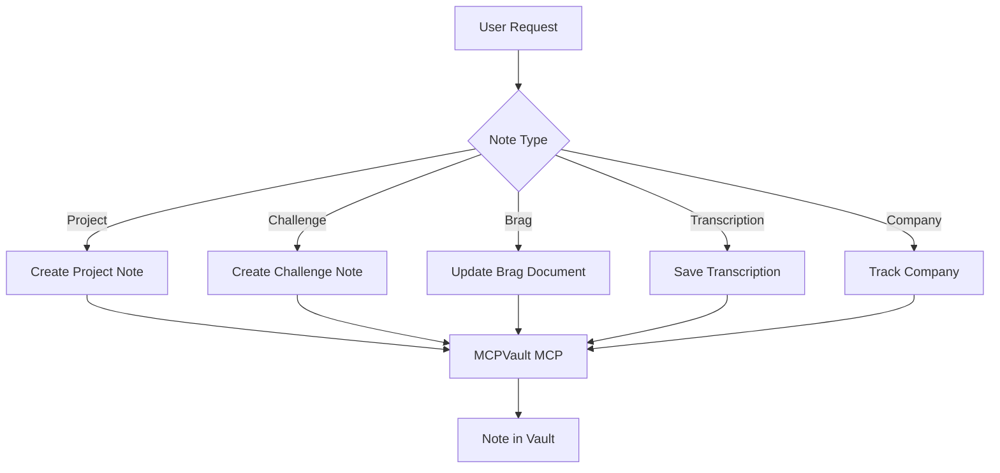

# Session Notes

Structured note creation for Obsidian using MCPVault MCP.

## What It Does

Creates and manages documentation in the Obsidian vault with consistent
structure across five note types:

- **Projects** — Full project documentation (overview, goals, architecture)
- **Challenges** — Technical interview challenges (take-homes, system design)
- **Brags** — Achievement tracking for performance reviews
- **Transcriptions** — Meetings, 1:1s, feedback sessions, lectures, courses
- **Companies** — Job application tracking (timeline, status, decision)



| Note Type | Folder | Pattern |
|-----------|--------|---------|
| Project | `{VaultFolder}/{Project}/` | `{Project Name} Overview.md` |
| Challenge | `Challenges/{Company}/` | `{Type Topic}.md` |
| Brag | `Brags/` | `{YYYY}.md` or `{YYYY} Q1.md` |
| Transcription | `Meetings/` or `Courses/` | `{Description}.md` |
| Company | `Companies/{Company}/` | `{Role} — {Company}.md` |

## Usage

```
create project note for checkout-refactor
record technical challenge from Stripe interview
add brag: reduced latency by 40%
save transcription from yesterday's 1:1
track company application — Stripe Senior Frontend
```

## Output

Notes are created in the Obsidian vault following this structure:

```
Vault/
├── {VaultFolder}/
│   └── {Project}/
│       └── {Project Name} Overview.md
├── Challenges/
├── Brags/
├── Meetings/
├── Courses/
└── Companies/
```

## Requirements

- MCPVault MCP server configured and connected
- At least one Obsidian vault configured
- `.notes/wrap-up.yml` registry configured (for project path resolution)

## FAQ

**Q: How do filenames handle special characters?**
A: Invalid characters (`/ \ : * ? " < > |`) are removed; accented
characters are replaced with ASCII equivalents. All filenames are Title
Case.

**Q: What if a note with the same name exists?**
A: The skill detects duplicates via `search_notes` and asks whether to
append, choose a new name, or cancel.

**Q: Can the skill update existing notes?**
A: Yes. `read_note` + `patch_note` updates existing notes in place.
Templates apply only to new note creation.

**Q: How are wikilinks validated?**
A: Before adding a wikilink, the skill verifies the target file exists.
Orphan wikilinks (pointing to missing files) create empty files at the
vault root and are avoided.
