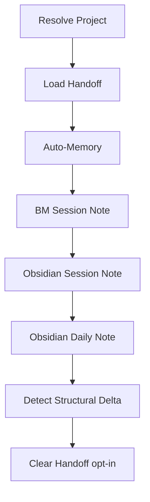

# Wrap Up Session

End-of-session documentation across auto-memory, Basic Memory, and Obsidian.

## What It Does



| Step | System | Output | Audience |
|------|--------|--------|----------|
| Resolve Project | -- | BM path, Obsidian path, base tags | Internal |
| Load Handoff | filesystem | Latest snapshot folded into context | Internal |
| Auto-Memory | Claude Code | Updated memory files | Agents |
| BM Session | Basic Memory | Session note (facts + reasoning) | Agents |
| Obsidian Session | Obsidian | Session note (work details) | Humans |
| Obsidian Daily | Obsidian | Daily note (day summary) | Humans |
| Cleanup | filesystem | Empty handoff file (opt-in) | Internal |

## Usage

```
wrap up
end session
finish up
close session
```

## Output

- Auto-memory files in `.claude/projects/.../memory/`
- BM notes under `{bm.path}/sessions/`
- Obsidian session notes under `{obsidian.path}/Sessions/`
- Obsidian daily note in `Daily/YYYY-MM-DD.md`

## Requirements

- Basic Memory MCP server (for BM notes)
- MCPVault MCP server (for Obsidian notes)
- Auto-memory configured in Claude Code
- `.notes/` symlink in the repo root pointing to the Obsidian vault
- `wrap-up.yml` at the vault root with a `projects` registry

## FAQ

**Q: What happens if Basic Memory or Obsidian MCP is unavailable?**
A: The corresponding step is skipped with a warning. The other steps
continue. The skill is best-effort across systems.

**Q: Does it ask before clearing the session handoff?**
A: Yes. The handoff persists across sessions by design, so wrap-up
asks before clearing it. Decline to keep snapshot history; accept to
reset.

**Q: Can I run wrap-up multiple times in a day?**
A: Yes. Existing notes are detected and appended to rather than
overwritten. The daily note merges activities from each invocation.

**Q: What if the project is not in the registry yet?**
A: A bootstrap prompt asks for project name, BM project, BM path,
Obsidian path, and base tags. The new entry is appended to
`wrap-up.yml`.
