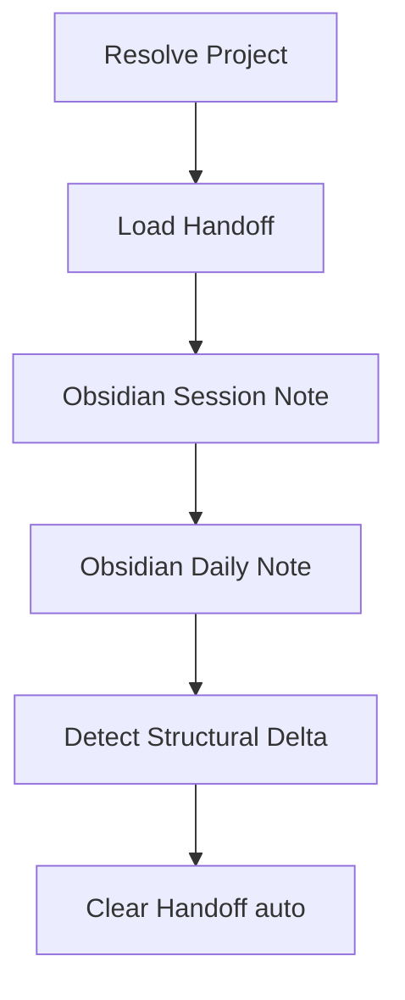

# Wrap Up Session

End-of-session documentation to Obsidian.

## What It Does



| Step | System | Output | Audience |
|------|--------|--------|----------|
| Resolve Project | -- | Obsidian path, base tags | Internal |
| Load Handoff | filesystem | All snapshots folded, grouped by date | Internal |
| Obsidian Session | Obsidian | Session note (work details) | Humans |
| Obsidian Daily | Obsidian | Daily note (day summary) | Humans |
| Cleanup | filesystem | Empty handoff file (auto) | Internal |

## Usage

```
wrap up
end session
finish up
close session
```

## Output

- Obsidian session notes under `{obsidian.path}/Sessions/`
- Obsidian daily note in `Daily/YYYY-MM/YYYY-MM-DD.md`

## Requirements

- MCPVault MCP server (for Obsidian notes)
- `.notes/` symlink in the repo root pointing to the Obsidian vault
- `wrap-up.yml` at the vault root with a `projects` registry

## FAQ

**Q: What happens if Obsidian MCP is unavailable?** A: The session step is skipped with a warning. The daily note still attempts to write. The skill is best-effort.

**Q: Does it ask before clearing the session handoff?** A: No. Wrap-up has already persisted every snapshot to Obsidian, so the on-disk handoff is redundant by the end — Cleanup auto-clears it (writes empty content) without asking.

**Q: Can I run wrap-up multiple times in a day?** A: Yes. Existing notes are detected and appended to rather than overwritten. The daily note merges activities from each invocation.

**Q: What if the project is not in the registry yet?** A: A bootstrap prompt asks for project name, Obsidian path, and base tags. The new entry is appended to `wrap-up.yml`.
