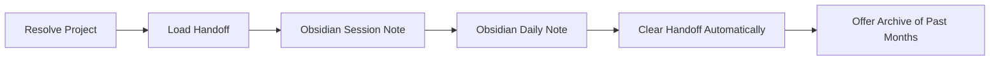

# Wrap Up Session

End-of-session documentation to Obsidian.

## What It Does


```mermaid
flowchart LR
    A[Resolve Project] --> B[Load Handoff]
    B --> C[Obsidian Session Note]
    C --> D[Obsidian Daily Note]
    D --> E[Clear Handoff Automatically]
    E --> F[Offer Archive of Past Months]
```

| Step | System | Output | Audience |
|------|--------|--------|----------|
| Resolve Project | -- | Obsidian path, base tags | Internal |
| Load Handoff | filesystem | Consolidated handoff context | Internal |
| Obsidian Session | Obsidian | Session note (work details) | Humans |
| Obsidian Daily | Obsidian | Daily note (day summary) | Humans |
| Cleanup | filesystem | Empty handoff file (auto) | Internal |
| Archive offer | Obsidian | Past-month daily notes moved into `Daily/YYYY-MM/` (on yes) | Humans |

## Usage

```text
wrap up
end session
finish up
close session
```

## Output

- Obsidian session notes under `{obsidian.path}/Sessions/`
- Obsidian daily note at `Daily/YYYY-MM-DD.md`; past months are archived into `Daily/YYYY-MM/` when you accept the offer at the end of a run

## Requirements

| Dependency | Status | Without it |
|------------|--------|------------|
| Obsidian MCP server | required | The workflow cannot write either note |

- An Obsidian vault. On first run the skill asks for its path, then creates the `wrap-up.yml` registry, the global pointer, and the `.notes/` symlink itself.

## FAQ

**Q: What happens if Obsidian MCP is unavailable?** A: The workflow cannot write the session note or the daily note because both use the Obsidian MCP server.

**Q: Does it ask before clearing the session handoff?** A: No. Cleanup writes empty content after every configured note write succeeds. If persistence fails, the handoff remains available for retry.

**Q: Does it move old daily notes on its own?** A: No. When daily notes from an earlier month remain at the root of `Daily/`, the report lists them and asks once whether to move them into `Daily/YYYY-MM/`. Nothing moves without a yes.

**Q: Can I run wrap-up multiple times in a day?** A: Yes. The workflow finds existing notes and appends the new content instead of overwriting them. The daily note merges activities from each invocation.

**Q: What if the project is not in the registry yet?** A: A bootstrap prompt asks for project name, Obsidian path, and base tags. The new entry is appended to `wrap-up.yml`.
