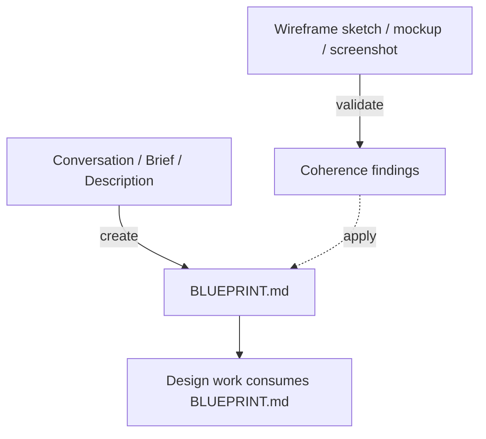

# Blueprint

Plans `BLUEPRINT.md` — the design-blind layout payload a design consumes.

## What It Does



| Step | Trigger | Output |
| ---- | ------- | ------ |
| **Create** | Author a fresh layout plan from conversation — surfaces, blocks, shapes, flow | `docs/design/BLUEPRINT.md` |
| **Validate** | Check a wireframe or existing plan for IA, flow, and intent coherence | Findings (patch via create, confirm-before-write) |

Arrangement is orthogonal to visual identity: the same `BLUEPRINT.md` holds
independent of visual styling, so this skill plans structure only — never
colors, fonts, tokens, copy strings, or requirement IDs. It emits the plan; a
downstream renderer draws the wireframe.

Each surface is arranged under a **register** — brand (the surface communicates)
or product (the surface serves a task) — which biases the block order and shapes.
Surfaces are named by context; storefronts straddle the two registers.

Each surface is also planned for real conditions — how it reflows on narrow
viewports and how it holds real data volume (none / typical / many) — as
structural intent, never pixels.

## Usage

```text
# Create a fresh layout plan
plan the layout for this landing page
map the information architecture for this app
arrange the screens and flow from this brief
draft a wireframe plan from this brief

# Validate a wireframe or existing plan
check this wireframe for coherence
does this screen flow hold up?
validate BLUEPRINT.md
review the page composition before we style it
```

## Output

`docs/design/BLUEPRINT.md` — a YAML frontmatter region tree (surfaces → blocks
with shape hints) plus a markdown body (screen map + per-surface rationale),
derived from the conversation or a brief.

## Requirements

- `WebFetch` for pulling a reference URL's structure (optional — sketches,
  screenshots, and described layouts work without it).
