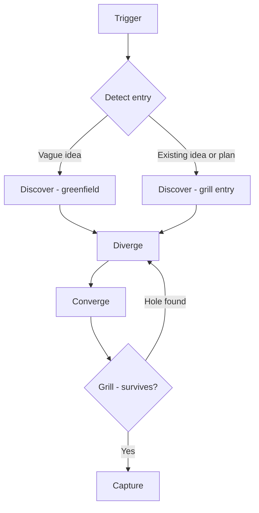

# Brainstorm

Structured idea exploration from vague to direction, or pressure-test of an existing idea or plan.

## What It Does

Explore ideas systematically before committing to a formal document or implementation, or stress-test an existing idea or plan before building:



| Phase | What Happens | Output |
|-------|-------------|--------|
| Detect entry | Classify entry state: greenfield (vague idea) or grill entry (existing idea or plan) | Entry selected |
| Discover | Map context, constraints, success criteria via decision tree | Understanding of the space |
| Diverge | Generate 4-8 alternatives using structured techniques; on grill entry the plan enters as baseline | Named alternatives |
| Converge | Evaluate trade-offs, compare, recommend | Chosen direction |
| Grill | Attack the chosen direction: key assumption by default, every assumption with `/brainstorm deep` | Survived direction, or loop back |
| Capture | Produce structured artifact | `docs/product/brainstorm.md` |

## Usage

```text
brainstorm ideas for the notification system
explore options for user onboarding
what should we build for the dashboard
think through the authentication approach
compare approaches for real-time updates
rethink the notification system design
is this approach still right
should I keep going with this architecture
pivot the onboarding flow
second opinion on the new API design
find holes in this auth plan
what am I missing in this proposal
stress-test my plan for the new API design
grill me on this architecture before we build it
/brainstorm deep
```

## Output

```text
docs/product/brainstorm.md
```

Single project-level file. Re-runs never create new artifacts: an unchanged direction appends a `— Validated` entry to `## Revision History`, a changed direction pivots the file, and a replace resets it while keeping a `— Replaced` entry as the trace of the abandoned direction.

## FAQ

**Q: When should I use brainstorming vs writing a doc directly?** A: Use brainstorming when ideas are vague and a direction has not been chosen. Use document writing when a direction is already chosen and needs to be formalized.

**Q: How many alternatives does it generate?** A: At least 4, aiming for 6-8. The skill pushes past obvious options using structured techniques like inversion and constraint removal.

**Q: Can I skip diverge if I already have a direction?** A: If you have a direction and want to formalize it, write the doc directly. If you want to stress-test it before committing, run brainstorming — grill entry treats the plan as the baseline alternative, then challenges it in diverge.

**Q: What does `/brainstorm deep` do?** A: Widens the grill phase — every assumption and dependency instead of only the key assumption, with evidence demands and an explicit failure criterion. It does not change the entry.

**Q: What happens if no direction emerges?** A: The workflow loops back to discovery with refined understanding. Constraints may need revisiting, or the problem may need reframing.
