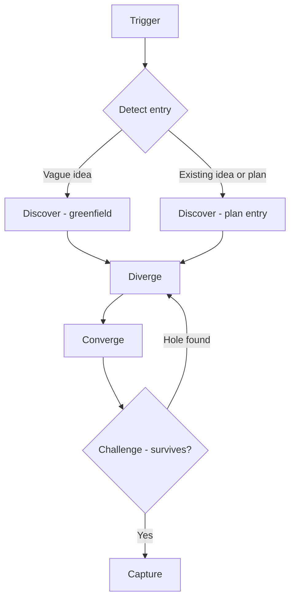

# Brainstorm

Structured idea exploration from vague to direction, or from an existing idea or plan.

## What It Does


```mermaid
flowchart TD
    T[Trigger] --> P{Detect entry}
    P -->|Vague idea| DS[Discover - greenfield]
    P -->|Existing idea or plan| DR[Discover - plan entry]
    DS --> DV[Diverge]
    DR --> DV
    DV --> C[Converge]
    C --> G{Challenge - survives?}
    G -->|Yes| CA[Capture]
    G -->|Hole found| DV
```

| Phase | Output |
|-------|--------|
| Detect entry | Entry selected: greenfield (vague idea) or plan entry (existing idea or plan) |
| Discover | Understanding of the space: context, constraints, and success criteria, mapped through a decision tree |
| Diverge | 4-8 named alternatives from structured techniques; on plan entry the plan enters as the baseline |
| Converge | Chosen direction, after evaluating trade-offs, comparing, and recommending |
| Challenge | Survived direction, or a loop back to diverge; the attack covers the key assumption by default, every assumption with `/brainstorm deep` |
| Capture | Structured artifact at `docs/product/brainstorm.md` |

## Usage

```text
brainstorm ideas for the notification system
explore options for user onboarding
what should we build for the dashboard
think through the authentication approach
compare approaches for real-time updates
rethink the notification system design
is this approach still right
should I keep going with this architecture
pivot the onboarding flow
second opinion on the new API design
/brainstorm deep
```

## Output

```text
docs/product/brainstorm.md
```

Single project-level file. Re-runs never create new artifacts: an unchanged direction appends a `— Validated` entry to `## Revision History`, a changed direction pivots the file, and a replace resets it while keeping a `— Replaced` entry as the trace of the abandoned direction.

## FAQ

**Q: When should I use brainstorming vs writing a doc directly?** A: Use brainstorming when ideas are vague and a direction has not been chosen. Use document writing when a direction is already chosen and needs to be formalized.

**Q: How many alternatives does it generate?** A: At least 4, aiming for 6-8. The skill pushes past obvious options using structured techniques like inversion and constraint removal.

**Q: Can I skip diverge if I already have a direction?** A: If you have a direction and want to formalize it, write the doc directly. If you want to weigh it against alternatives before committing, run brainstorming — plan entry treats the plan as the baseline alternative, then challenges it in diverge.

**Q: What does `/brainstorm deep` do?** A: Widens the challenge phase — every assumption and dependency instead of only the key assumption, with evidence demands and an explicit failure criterion. It does not change the entry.

**Q: What happens if no direction emerges?** A: The workflow loops back to discovery with refined understanding. Constraints may need revisiting, or the problem may need reframing.
