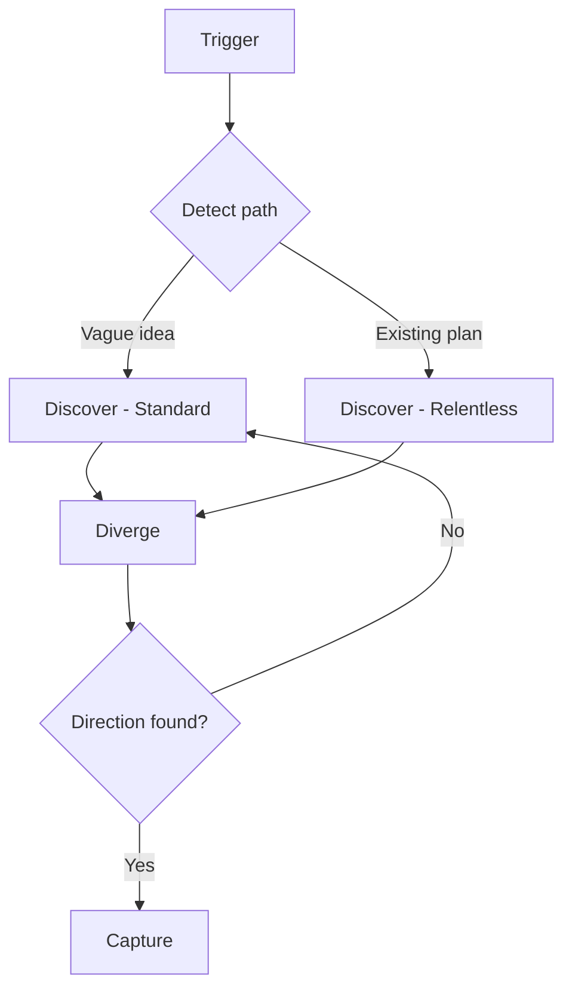

# Brainstorming

Structured idea exploration from vague to direction, or stress-test of an existing plan.

## What It Does

Explore ideas systematically before committing to a formal document or
implementation, or stress-test an existing plan before building:



| Phase | What Happens | Output |
|-------|-------------|--------|
| Detect path | Classify entry state: standard (vague idea) or relentless (existing plan) | Path selected |
| Discover | Map context, constraints, success criteria via decision tree | Understanding of the space |
| Diverge | Generate 4-8 alternatives using structured techniques | Named alternatives |
| Converge | Evaluate trade-offs, compare, recommend | Chosen direction |
| Capture | Produce structured artifact | `brainstorm-{topic}.md` |

## Usage

```
brainstorm ideas for the notification system
explore options for user onboarding
what should we build for the dashboard
think through the authentication approach
compare approaches for real-time updates
stress-test my plan for the new API design
grill me on this architecture before we build it
/brainstorming deep
```

## Output

```
.artifacts/brainstorm/{topic}.md
```

## FAQ

**Q: When should I use brainstorming vs writing a doc directly?**
A: Use brainstorming when ideas are vague and a direction has not been
chosen. Use document writing when a direction is already chosen and needs
to be formalized.

**Q: How many alternatives does it generate?**
A: At least 4, aiming for 6-8. The skill pushes past obvious options
using structured techniques like inversion and constraint removal.

**Q: Can I skip diverge if I already have a direction?**
A: If you have a direction and want to formalize it, write the doc
directly. If you want to stress-test it before committing, run
brainstorming with the relentless path — it pressure-tests the plan,
then explores alternatives in diverge.

**Q: What happens if no direction emerges?**
A: The workflow loops back to discovery with refined understanding.
Constraints may need revisiting, or the problem may need reframing.
