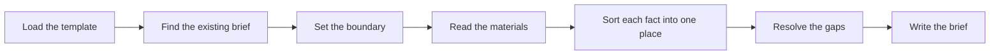

# Briefing

Creates, updates, and audits a work brief that stands on its own.

## What It Does



| Phase | Output |
| --- | --- |
| Load the template | The sections each fact goes to and the MUST NOT list |
| Find the existing brief | Sections kept, gaps and declared decisions re-checked, or an audit of empty sections, unjudged objectives, and open gaps |
| Set the boundary | Purpose, situation, and the decisions the user confirms |
| Read the materials | Facts, declared decisions, constraints, references, and conflicts |
| Sort each fact into one place | Each fact in the section that owns it, solution-limiting choices from third-party materials with a source, open items as gaps |
| Resolve the gaps | Questions, effect on the work, owners, and timing |
| Write the brief | A draft brief ready for review when every gap has an owner and a stage |

## Usage

```text
create a briefing from these project notes
consolidate this context into a briefing
update the briefing with the client's answers
what is missing from this briefing
prepare a brief from these materials
```

## Output

```text
docs/product/briefing.md            # one brief per project
docs/product/briefing-<work>.md     # when the project holds several works
```

The brief carries a Status line. The skill writes `Draft`; the user sets `Agreed` once the requester and the performer accept it.
