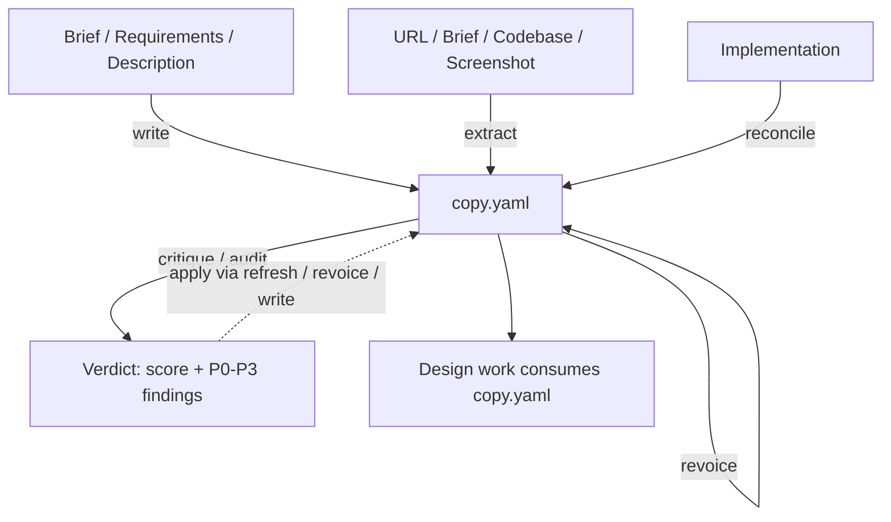

# Copywriting

Authors and judges `copy.yaml` — the structured content payload a design consumes.

## What It Does



| Step | Trigger | Output |
| ---- | ------- | ------ |
| **Write** | Author fresh copy from intent — headlines, body, CTAs | `docs/design/copy.yaml` |
| **Extract** | Structure existing content from a URL, brief, codebase, or screenshot, preserving tone | `docs/design/copy.yaml` |
| **Refresh** | Tighten existing copy in the same voice — clarity, specificity, proof, cut weak words | Patched `docs/design/copy.yaml` (confirm-before-write) |
| **Revoice** | Rewrite existing copy in a new voice, keeping the message | Patched `docs/design/copy.yaml` (confirm-before-write) |
| **Reconcile** | Sync `copy.yaml` from a drifted implementation (copy edited in code) | Patched `docs/design/copy.yaml` (confirm-before-write) |
| **Critique** | Quality and slop verdict on a draft — scores the seven sweeps, loops to refresh | Verdict + score (no write) |
| **Audit** | Ship-readiness defect report on `copy.yaml` before handoff — P0–P3 | Report + score (no write) |

Content is orthogonal to design: the same `copy.yaml` works independent of
visual styling, so this skill carries words only — never colors, fonts, or layout.

Copy is set by **register** (brand — the words are the product; or product — the
words serve the task) and organized by **surface** (the granular type, named by
context). A surface sits under a register; storefronts straddle.

## Usage

```text
# Write fresh copy from intent
write landing page copy from this brief
write the hero and CTA for this product
draft homepage copy from these requirements

# Extract / structure existing content
extract copy from https://example.com
extract content from this brief (PDF/DOCX)
web capture the hero section of https://competitor.com
structure the copy from this codebase

# Refresh / tighten existing copy (same voice)
tighten the copy in copy.yaml
refresh this stale page copy
sharpen the messaging

# Revoice / rewrite in a new voice (keep the message)
rewrite this copy in a more playful voice
revoice copy.yaml to sound more premium
make the copy drier, less salesy

# Reconcile (brownfield drift: implementation back to copy.yaml)
sync copy.yaml from this codebase
update copy.yaml from the implementation
reconcile content drift

# Critique / audit (judge existing copy, non-mutating)
critique this copy — does it read as AI slop?
score this landing page copy
audit copy.yaml before handoff
is this copy ready to ship?
```

## References

Loaded on demand: `references/brand.md` / `references/product.md` (register
posture — read the matching one first), `references/copy-frameworks.md` (headline
formulas, content-part types, page shapes, CTA), `references/voice.md` (register
bias, voice axes, proof hierarchy), `references/editing-sweeps.md` (Seven Sweeps,
quick-pass, plain-English), `references/ux-writing.md` (clarity craft: the
assess→plan→improve→verify method, clarity principles, microcopy,
a11y/i18n/terminology), `references/anti-patterns.md` (copy slop catalog — dead
words, dead structures, AI tells, proof failures), and `references/scoring.md`
(severity, bands, and the report template critique and audit share).

## Output

`docs/design/copy.yaml` — a context-named content tree (surfaces → parts —
headline, body, cta, labels, states, images — named by context), mirroring the
source or the brief.

## Requirements

- `WebFetch` for URL extraction (optional — screenshots and pasted content work
  without it).
- `python3` for the bundled scripts — `slop_scan.py` (slop scan for critique and
  audit) and `validate_copy.py` (well-formedness and design-leakage scan for the
  authoring self-checks). Optional — the judgment and self-checks work without them.
