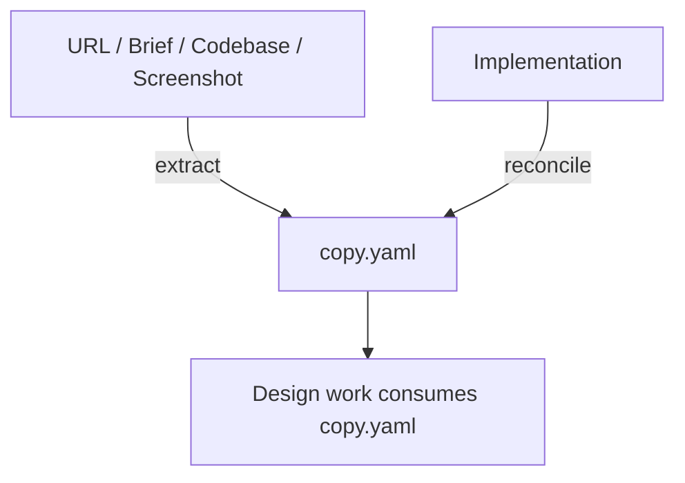

# Copywriting

Authors `copy.yaml` — the structured content payload a design consumes.

## What It Does



| Step | Trigger | Output |
| ---- | ------- | ------ |
| **Extract** | Structure existing content from a URL, brief, codebase, or screenshot, preserving tone | `docs/design/copy.yaml` |
| **Reconcile** | Sync `copy.yaml` from a drifted implementation (copy edited in code) | Patched `docs/design/copy.yaml` (confirm-before-write) |

Content is orthogonal to design: the same `copy.yaml` must render under any
`DESIGN.md`, so this skill carries words only — never colors, fonts, or layout.

## Usage

```text
# Extract / structure existing content
extract copy from https://example.com
extract content from this brief (PDF/DOCX)
web capture the hero section of https://competitor.com
structure the copy from this codebase

# Reconcile (brownfield drift: implementation back to copy.yaml)
sync copy.yaml from this codebase
update copy.yaml from the implementation
reconcile content drift
```

## Output

`docs/design/copy.yaml` — a context-named content tree (surfaces → parts →
headline, body, cta, images), mirroring the source's structure.

## Requirements

- `WebFetch` for URL extraction (optional — screenshots and pasted content work
  without it).
