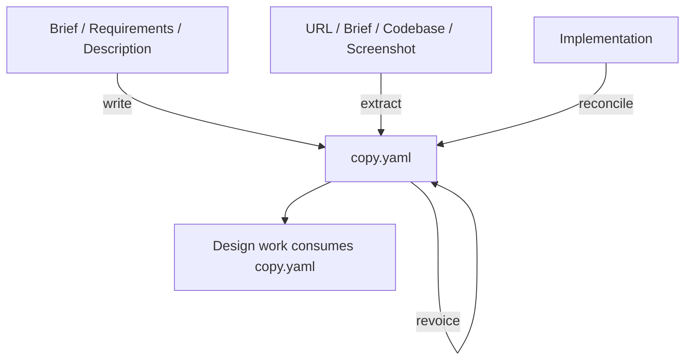

# Copywriting

Authors `copy.yaml` — the structured content payload a design consumes.

## What It Does



| Step | Trigger | Output |
| ---- | ------- | ------ |
| **Write** | Author fresh copy from intent — headlines, body, CTAs | `docs/design/copy.yaml` |
| **Extract** | Structure existing content from a URL, brief, codebase, or screenshot, preserving tone | `docs/design/copy.yaml` |
| **Refresh** | Tighten existing copy in the same voice — clarity, specificity, proof, cut weak words | Patched `docs/design/copy.yaml` (confirm-before-write) |
| **Revoice** | Rewrite existing copy in a new voice, keeping the message | Patched `docs/design/copy.yaml` (confirm-before-write) |
| **Reconcile** | Sync `copy.yaml` from a drifted implementation (copy edited in code) | Patched `docs/design/copy.yaml` (confirm-before-write) |

Content is orthogonal to design: the same `copy.yaml` must render under any
`DESIGN.md`, so this skill carries words only — never colors, fonts, or layout.

## Usage

```text
# Write fresh copy from intent
write landing page copy from this brief
write the hero and CTA for this product
draft homepage copy from these requirements

# Extract / structure existing content
extract copy from https://example.com
extract content from this brief (PDF/DOCX)
web capture the hero section of https://competitor.com
structure the copy from this codebase

# Refresh / tighten existing copy (same voice)
tighten the copy in copy.yaml
refresh this stale page copy
sharpen the messaging

# Revoice / rewrite in a new voice (keep the message)
rewrite this copy in a more playful voice
revoice copy.yaml to sound more premium
make the copy drier, less salesy

# Reconcile (brownfield drift: implementation back to copy.yaml)
sync copy.yaml from this codebase
update copy.yaml from the implementation
reconcile content drift
```

## References

Loaded on demand: `references/copy-frameworks.md` (headline formulas, content-part
types, page shapes, CTA), `references/voice.md` (voice axes, proof hierarchy,
dead words), and `references/editing-sweeps.md` (Seven Sweeps, quick-pass,
plain-English).

## Output

`docs/design/copy.yaml` — a context-named content tree (surfaces → parts →
headline, body, cta, images), mirroring the source or the brief.

## Requirements

- `WebFetch` for URL extraction (optional — screenshots and pasted content work
  without it).
