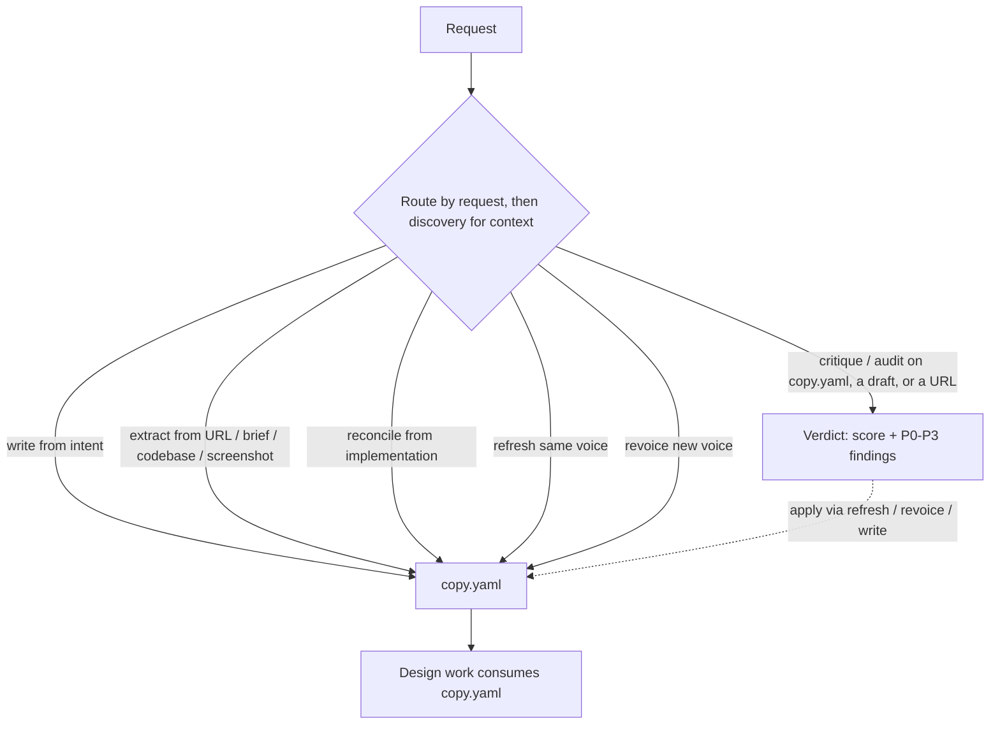

# Copywriting

Authors and judges `copy.yaml` across conversion, brand, editorial, product, UX, and informational surfaces.

## What It Does


```mermaid
flowchart TD
    R[Request] --> DSC{Route by request, then discovery for context}
    DSC -->|write from intent| B[copy.yaml]
    DSC -->|extract from URL / brief / codebase / screenshot| B
    DSC -->|reconcile from implementation| B
    DSC -->|refresh same voice| B
    DSC -->|revoice new voice| B
    DSC -->|critique / audit on copy.yaml, a draft, or a URL| V[Verdict: score + P0-P3 findings]
    V -.->|apply via refresh / revoice / write| B
    B --> D[Design work consumes copy.yaml]
```

| Operation | Output |
| --------- | ------ |
| **Write** | `docs/product/copy.yaml` with fresh or net-new copy authored from intent: headlines, body, CTAs |
| **Extract** | `docs/product/copy.yaml` structured from existing content in a URL, brief, codebase, or screenshot, preserving tone |
| **Refresh** | Patched `docs/product/copy.yaml` tightened in the same voice (clarity, specificity, proof, weak words cut), changes reported in chat |
| **Revoice** | Patched `docs/product/copy.yaml` rewritten in a new voice that keeps the message, changes reported in chat |
| **Reconcile** | Patched `docs/product/copy.yaml` synced from a drifted implementation where copy was edited in code, changes reported in chat |
| **Critique** | Quality and slop verdict with a score across the seven sweeps on a draft, `copy.yaml`, or a URL; no write, and the fix runs through refresh |
| **Audit** | Ship-readiness defect report with P0-P3 findings and a score on `copy.yaml` before handoff; no write |

## Usage

```text
write landing page copy from this brief
write the hero and CTA for this product
draft homepage copy from these requirements
write an empty state for a dashboard
draft help content for this settings flow
extract copy from https://example.com
extract content from this PDF brief into copy.yaml
web capture the hero section of https://competitor.com
structure the copy from this codebase
tighten the copy in copy.yaml
refresh this stale page copy in the same voice
sharpen the messaging in copy.yaml
rewrite this copy in a more playful voice
revoice copy.yaml to sound more premium
make the copy drier, less salesy
sync copy.yaml from this codebase
update copy.yaml from the implementation
reconcile copy.yaml with the copy edited in the code
critique this copy: does it read as AI slop?
score this landing page copy
audit copy.yaml before handoff
is this copy ready to ship?
```

## Output

`docs/product/copy.yaml`: a context-named content tree (surfaces → parts: headline, body, cta, labels, states, images: named by context), mirroring the source or the brief. It records `intent` and `voice`, so later sessions keep the agreed purpose, limits, and tone instead of deriving them again.

## Requirements

- `WebFetch` for URL extraction (optional: screenshots and pasted content work without it).
- `python3` for the bundled scripts: `slop_scan.py` (slop scan for critique and audit) and `validate_copy.py` (well-formedness and design-leakage scan for the authoring self-checks). Optional: the judgment and self-checks work without them.

## FAQ

**Q: Does `copy.yaml` carry any design decisions?** A: No. It carries words only, never colors, fonts, or layout, so the same `copy.yaml` works with any visual styling.

**Q: Are conversion patterns applied to every page?** A: No. `copy.yaml` records an intent (purpose, reader goal, function, and functional constraints) and a separate voice, and the function (conversion, brand/editorial, product/UX, or informational) selects the writing patterns. Conversion patterns apply only to a surface whose intent supports a decision, and a surface may override the root intent when its reader job differs.
