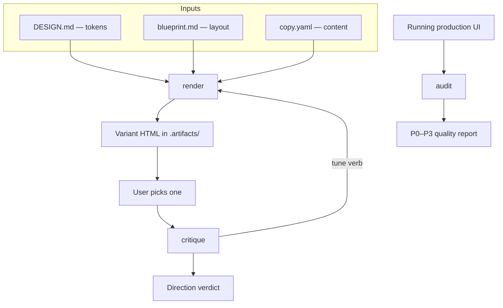

# Craft UI

craft-ui — build the interface from the upstream design artifacts and pressure-test it, across three non-mutating modes.

## What It Does



| Mode | Target | Output |
| ---- | ------ | ------ |
| **render** | DESIGN.md + blueprint.md + copy.yaml | N variants served side by side in `.artifacts/`; tune, comment, switch viewport |
| **critique** | the chosen variant | direction verdict — slop test, Nielsen score /40, persona red flags, P0–P3 refinements that loop into render's tune verbs |
| **audit** | a running production UI | quality report — 5 dimensions /20, anti-pattern verdict, defects by P0–P3 severity |

Every mode here works on rendered design, never source. render is the **integrator**
— the one mode that reads DESIGN.md, blueprint.md, and copy.yaml together — and it
writes only variant HTML. critique and audit produce only a judgment. Nothing
here mutates a source artifact or production code.

## Usage

```text
# render — generate, compare, tune (writes only .artifacts/)
generate 4 variants
generate variants in an editorial direction
render this page                         # no DESIGN.md yet → compose a seed direction
make it denser / try a bento layout      # tune the chosen variant
make it bolder / quieter / harden        # tune verbs

# critique — judge a chosen variant before building
critique this variant
does this read as AI slop?
score the usability of the picked design

# audit — judge a running UI before release
audit this page                          # paste a URL or screenshot
is this production-ready?
run an accessibility and performance pass
```

To make a tuned direction permanent, invoke the owning skill — layout, visual
identity, or copy. An audit defect is fixed in implementation. Every mode here explores or
judges — none edits.

## Output

```text
.artifacts/design/
└── variants/            # render: variant HTML + .events session log + final.html
```

critique and audit write nothing — the verdict and the report are delivered in
chat. Variant HTML is a decision aid, not a handoff; the handoff to
implementation is the source set (`DESIGN.md`, `blueprint.md`, `copy.yaml`).

## References

The shared rubric every mode composes:

- `references/brand.md` / `references/product.md` — brand vs product posture (set first)
- `references/design-thinking.md` — Four Questions, direction, slop test
- `references/heuristics.md` — Nielsen heuristics + 0–4 scoring + visual laws
- `references/cognitive-load.md` — load checklist + working-memory rule
- `references/personas.md` — five archetypes to test through
- `references/color.md` — OKLCH, palette, contrast, dark mode
- `references/typography.md` — scale, pairing, loading
- `references/layout.md` — spacing, grid, hierarchy, depth
- `references/motion.md` — timing, easing, materials, ambitious tier
- `references/interaction.md` — states, focus, overlays, keyboard
- `references/responsive.md` — breakpoints, input method, safe areas
- `references/tune.md` — render/critique tune directions (bolder, quieter, distill, delight, harden)
- `references/anti-patterns.md` — failure modes with HTML fail/pass examples
- `references/web-standards.md` — technical rules render applies and audit checks
- `references/performance.md` — loading, rendering, network, Core Web Vitals
- `references/scoring.md` — severity, score bands, report template

## Requirements

- Bun (for the render server)

## FAQ

**Q: Does it edit DESIGN.md, blueprint.md, copy.yaml, or production code?**

A: No — non-mutating end to end. render reads the three inputs and writes only variant HTML to `.artifacts/`; critique and audit produce only a judgment. To make a direction permanent or fix a defect, the change happens in the owning skill or in implementation.

**Q: When do I use critique vs audit?**

A: critique judges a **variant** before you build it — a direction verdict that loops back into render's tune verbs. audit judges a **running UI** after you build it — a P0–P3 quality report. critique is coupled to render; audit works on any build.

**Q: What if I don't have a DESIGN.md or copy.yaml yet?**

A: render still works. Any missing input falls back — compose a seed direction, fill content with placeholders — so you can preview the product at any stage. Missing inputs are flagged as illustrative.

**Q: Does audit check whether the build matches the design system?**

A: No. audit is quality-only — accessibility, performance, responsive, theming consistency, and AI-slop tells. Whether a build matches its token source is a separate concern, out of scope for this skill.
