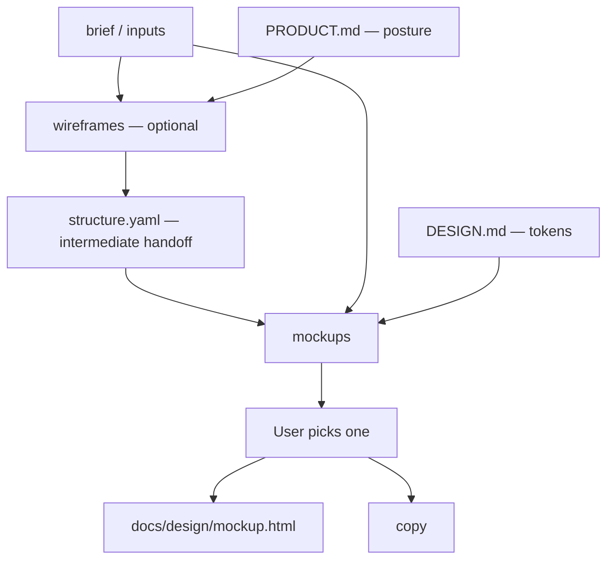

# Craft UI

craft-ui — decide how the interface is arranged, then how it looks, by building both.

## What It Does


```mermaid
flowchart TD
    I[brief / inputs] --> W[wireframes — optional]
    P[PRODUCT.md — posture] --> W
    W --> S[structure.yaml — intermediate handoff]
    S --> M[mockups]
    I --> M
    D[DESIGN.md — tokens] --> M
    M --> Pick[User picks one]
    Pick --> F[docs/design/mockup.html]
    Pick --> C[copy]
```

| Phase | Output |
|-------|--------|
| **wireframes** | optional interview and N lo-fi arrangements per surface; the chosen arrangement becomes the intermediate `structure.yaml` handoff |
| **mockups** | N directions rendered from `structure.yaml` when present, or with an arrangement chosen per direction when absent; the chosen one lands in `docs/design/` |

When a wireframe exists, it decides the arrangement with no look to judge it by — no palette, no font pick, no tokens. When no wireframe exists, each mockup direction may decide its own arrangement. Final copy comes after the mockup; craft-ui uses brief inputs and neutral placeholders while deciding the design.

## Usage

```text
plan the layout for these screens        # wireframes — optional arrangement handoff
map the screen flow                      # wireframes — stops at the plan
generate 4 directions                    # mockups — reads structure.yaml when present
generate mockups in an editorial direction
render this page                         # no DESIGN.md yet → composes a seed direction
make it denser / more editorial          # re-renders the chosen mockup
the header from B with the hero from C   # composite → re-rendered whole as a new direction
move the pricing above the features      # changes the arrangement for the active direction
```

## Output

```text
.artifacts/design/
├── structure.yaml       # intermediate handoff when wireframes are used
├── wireframes/          # optional lo-fi arrangement HTML + .events session log
├── mockups/             # full-page HTML per direction + .events session log
└── VARIANTS.md          # append-only log of the directions each surface already spent

docs/design/
└── mockup.html          # the chosen mockup (mockup-{surface}.html with more than one surface)
```

When present, `structure.yaml` is the intermediate handoff from wireframes to mockups. Without it, each mockup direction may choose its own arrangement. `VARIANTS.md` records which directions are spent and what the winning choice turned on, so a later round neither repeats a spent direction nor reopens a settled one without knowing why it was settled. The wireframes and mockups themselves are regenerable.

The delivered `docs/design/mockup.html` is self-contained — it opens in a browser with no build step, so anything downstream reads it as it is.

## References

Each phase composes only the references its job needs.

Wireframe:

- `references/structure.md` — region tree, shape vocabulary, reflow, volume, structural self-check

Mockup:

- `references/brand.md` / `references/product.md` — the register's permissions and bans
- `references/design-thinking.md` — Four Questions, style axes, color strategy, slop test, density and variance dials
- `references/visual-laws.md` — Gestalt, hierarchy, balance, reading patterns
- `references/color.md` — OKLCH, palette, contrast, dark mode
- `references/typography.md` — scale, pairing, loading
- `references/layout.md` — spacing, grid, hierarchy, hero composition, depth
- `references/motion.md` — the animate gate, timing, easing, materials
- `references/interaction.md` — states, focus, overlays, keyboard
- `references/responsive.md` — breakpoints, input method, safe areas
- `references/anti-patterns.md` — failure modes with HTML fail/pass examples
- `references/web-standards.md` — technical rules applied to every mockup

## Requirements

- Bun (for the render server)
- Python 3 (for the structure linter; PyYAML is used when installed, and a bundled reader covers the template's own format when it is not)

## FAQ

**Q: What does it write?**

A: Its own artifacts only — optional wireframes, mockups, the optional `structure.yaml` handoff, and `VARIANTS.md` under `.artifacts/design/`, plus the chosen mockup at `docs/design/mockup.html`. It never writes `DESIGN.md`, `copy.yaml`, `PRODUCT.md`, or production code. Final wording is authored after the mockup; this phase only uses neutral placeholders.

**Q: Can I skip the wireframe and go straight to mockups?**

A: Yes. When `structure.yaml` exists, every direction renders its arrangement. When it does not, each direction may choose its own arrangement and look.

**Q: What if I don't have a brief, PRODUCT.md, or DESIGN.md yet?**

A: It still works. The wireframe interviews for what the inputs do not answer, and the mockup phase falls back to inferred direction and neutral placeholders. Missing inputs are flagged as illustrative. On a project that already carries a font stack, a palette, and components in code, the mockup phase reads them and offers what the product wears today as one of the directions — rendering the components it already ships rather than inventing new ones — so extending it and redesigning it are the same comparison.

**Q: Does it critique or audit the result?**

A: No. craft-ui decides an arrangement and a direction, and stops. Judging a built page — usability scores, accessibility and performance passes, slop verdicts — is a separate job; point a review tool at `docs/design/mockup.html`, which needs no build step to read.
