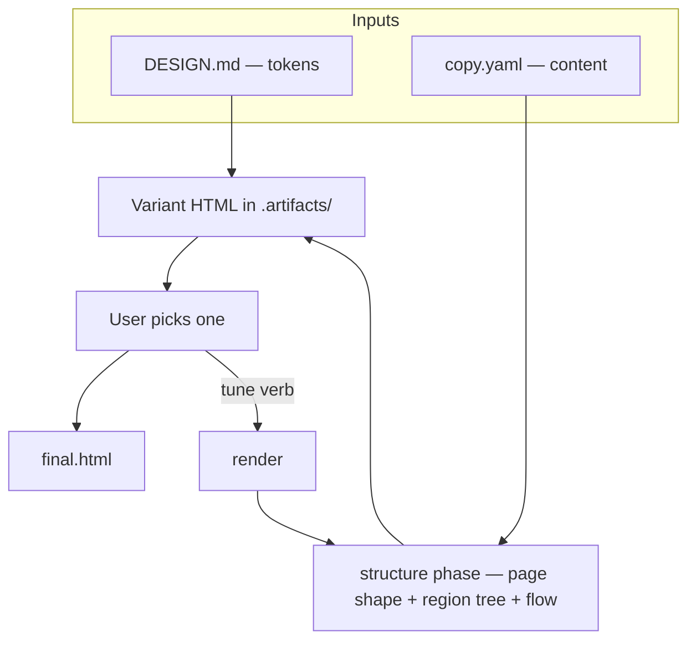

# Craft UI

craft-ui — build the interface from the upstream design artifacts to decide its visual direction, without touching production.

## What It Does


```mermaid
flowchart TD
    subgraph inputs[Inputs]
      D[DESIGN.md — tokens]
      C[copy.yaml — content]
    end
    R[render] --> ST[structure phase — page shape + region tree + flow]
    C --> ST
    ST --> V[Variant HTML in .artifacts/]
    D --> V
    V --> Pick[User picks one]
    Pick --> F[final.html]
    Pick -->|tune verb| R
```

| Phase | Output |
|-------|--------|
| **structure** | page shape per surface, region tree, screen flow — cached as `structure.yaml`; the run can stop here |
| **generation** | N variants served side by side in `.artifacts/`, one line each in `VARIANTS.md` |
| **tune** | the chosen variant re-rendered along a named direction; comment, switch viewport |

render is the **integrator** — the one place that resolves the layout structure and reads DESIGN.md and copy.yaml together — and it writes only to `.artifacts/` (`structure.yaml`, variant HTML, `final.html`, and the `VARIANTS.md` log). Nothing here mutates a `docs/` source or production code.

## Usage

```text
plan the layout for these screens        # structure phase only — page shape + region tree + flow
generate 4 variants
generate variants in an editorial direction
render this page                         # no DESIGN.md yet → compose a seed direction
make it denser / split that section      # tune the chosen variant
make it bolder / quieter / harden        # tune verbs
try a bento grid instead                 # a different page shape — re-plans the structure
```

To make a tuned direction permanent, invoke the owning skill — layout, visual identity, or copy. craft-ui explores; it does not edit.

## Output

```text
.artifacts/design/
├── VARIANTS.md          # append-only log of what each surface already tried
├── final.html           # the variant the user chose (final-{surface}.html when the run is scoped to one surface)
└── variants/            # structure.yaml + variant HTML + .events session log
```

`VARIANTS.md` is the one artifact that outlives a session — the `variants/` directory is regenerable, this file is the record a later render reads so it neither repeats a spent direction nor re-rolls a surface's arrangement.

`structure.yaml` and the variant HTML are session artifacts and decision aids, not a handoff; the handoff to implementation is the source set (`DESIGN.md`, `copy.yaml`) plus the chosen variant. `final.html` is self-contained — it opens in a browser with no build step, so anything downstream can read it as it is.

## References

render composes the references its job needs:

- `references/brand.md` / `references/product.md` — brand vs product posture and structural arrangement (set first)
- `references/macrostructures.md` — named page-shape presets per register, with knobs and exclusions
- `references/archetypes.md` — region set plus chrome and close compositions, reflex entries marked
- `references/structure.md` — region tree, shape vocabulary, reflow, structural self-check
- `references/design-thinking.md` — Four Questions, color strategy, slop test, density/variance dials
- `references/visual-laws.md` — Gestalt, hierarchy, balance, reading patterns
- `references/color.md` — OKLCH, palette, contrast, dark mode
- `references/typography.md` — scale, pairing, loading
- `references/layout.md` — spacing, grid, hierarchy, hero composition, depth
- `references/motion.md` — the animate gate, timing, easing, materials
- `references/overdrive.md` — the ambitious-tier motion tune (brand only)
- `references/interaction.md` — states, focus, overlays, keyboard
- `references/responsive.md` — breakpoints, input method, safe areas
- `references/tune.md` — the tune directions (bolder, quieter, distill, delight, harden)
- `references/anti-patterns.md` — failure modes with HTML fail/pass examples
- `references/web-standards.md` — technical rules applied to every variant

## Requirements

- Bun (for the render server)

## FAQ

**Q: Does it edit DESIGN.md, copy.yaml, or production code?**

A: No — non-mutating end to end. render resolves the structure and reads the inputs, writing only to `.artifacts/` (`structure.yaml`, variant HTML, `final.html`, and the `VARIANTS.md` log). To make a style permanent, the change happens in the owning skill.

**Q: What if I don't have a DESIGN.md or copy.yaml yet?**

A: render still works. The structure phase composes a layout when none is planned, and any missing input falls back — seed direction, placeholder content — so you can preview the product at any stage. Missing inputs are flagged as illustrative. On a project that already carries a font stack and a palette in code, render reads them and offers what the product wears today as one of the variants, so extending it and redesigning it are the same comparison.

**Q: Does it critique or audit the result?**

A: No. craft-ui explores a direction and stops. Judging a built page — usability scores, accessibility and performance passes, slop verdicts — is a separate job; point a review tool at `.artifacts/design/final.html`, which is self-contained and needs no build step to read.
