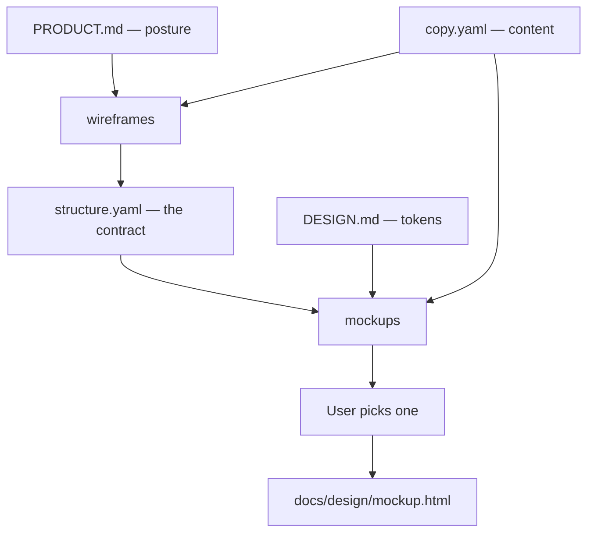

# Craft UI

craft-ui — decide how the interface is arranged, then how it looks, by building both.

## What It Does


```mermaid
flowchart TD
    P[PRODUCT.md — posture] --> W[wireframes]
    C[copy.yaml — content] --> W
    W --> S[structure.yaml — the contract]
    S --> M[mockups]
    D[DESIGN.md — tokens] --> M
    C --> M
    M --> Pick[User picks one]
    Pick --> F[docs/design/mockup.html]
```

| Phase | Output |
|-------|--------|
| **wireframes** | an interview, then N lo-fi arrangements per surface to compare; the chosen one becomes `structure.yaml` |
| **mockups** | the settled arrangement rendered in N visual directions, one line each in `VARIANTS.md`; the chosen one lands in `docs/design/` |

The wireframe decides the arrangement with no look to judge it by — no palette, no font pick, no tokens. The mockup phase is the **integrator**: it renders `structure.yaml`, `DESIGN.md`, and `copy.yaml` together, and never re-plans the arrangement it was given.

## Usage

```text
plan the layout for these screens        # wireframes — interview, arrangements, structure.yaml
map the screen flow                      # wireframes — stops at the plan
generate 4 directions                    # mockups — reads structure.yaml
generate mockups in an editorial direction
render this page                         # no DESIGN.md yet → composes a seed direction
make it denser / more editorial          # re-renders the chosen mockup
move the pricing above the features      # an arrangement change → structure.yaml, then re-render
```

## Output

```text
.artifacts/design/
├── structure.yaml       # the arrangement contract the mockups render
├── wireframes/          # lo-fi arrangement HTML + .events session log
├── mockups/             # full-page HTML per direction + .events session log
└── VARIANTS.md          # append-only log of the directions each surface already spent

docs/design/
└── mockup.html          # the chosen mockup (mockup-{surface}.html with more than one surface)
```

`structure.yaml` is the contract between the phases and the one place an arrangement changes. `VARIANTS.md` records which directions are spent, so a later round neither repeats one nor re-rolls a surface it already settled. The wireframes and mockups themselves are regenerable.

The delivered `docs/design/mockup.html` is self-contained — it opens in a browser with no build step, so anything downstream reads it as it is.

## References

Each phase composes only the references its job needs.

Wireframe:

- `references/structure.md` — region tree, shape vocabulary, reflow, volume, structural self-check

Mockup:

- `references/brand.md` / `references/product.md` — the register's permissions and bans
- `references/design-thinking.md` — Four Questions, style axes, color strategy, slop test, density and variance dials
- `references/visual-laws.md` — Gestalt, hierarchy, balance, reading patterns
- `references/color.md` — OKLCH, palette, contrast, dark mode
- `references/typography.md` — scale, pairing, loading
- `references/layout.md` — spacing, grid, hierarchy, hero composition, depth
- `references/motion.md` — the animate gate, timing, easing, materials
- `references/interaction.md` — states, focus, overlays, keyboard
- `references/responsive.md` — breakpoints, input method, safe areas
- `references/anti-patterns.md` — failure modes with HTML fail/pass examples
- `references/web-standards.md` — technical rules applied to every mockup

## Requirements

- Bun (for the render server)

## FAQ

**Q: What does it write?**

A: Its own artifacts only — the wireframes, the mockups, `structure.yaml`, and `VARIANTS.md` under `.artifacts/design/`, plus the chosen mockup at `docs/design/mockup.html`. It never writes `DESIGN.md`, `copy.yaml`, `PRODUCT.md`, or production code. To make a look permanent, the tokens are authored where tokens live; to change wording, the content is authored where content lives.

**Q: Can I skip the wireframe and go straight to mockups?**

A: Only when `structure.yaml` already exists. Without it the run settles the arrangement first — every mockup renders the same arrangement, so the comparison is about the look alone, and there has to be one to render.

**Q: What if I don't have a PRODUCT.md, DESIGN.md, or copy.yaml yet?**

A: It still works. The wireframe interviews for what the artifacts do not answer, and any missing input in the mockup phase falls back — seed direction, placeholder content — so you can preview the product at any stage. Missing inputs are flagged as illustrative. On a project that already carries a font stack and a palette in code, the mockup phase reads them and offers what the product wears today as one of the directions, so extending it and redesigning it are the same comparison.

**Q: Does it critique or audit the result?**

A: No. craft-ui decides an arrangement and a direction, and stops. Judging a built page — usability scores, accessibility and performance passes, slop verdicts — is a separate job; point a review tool at `docs/design/mockup.html`, which needs no build step to read.
