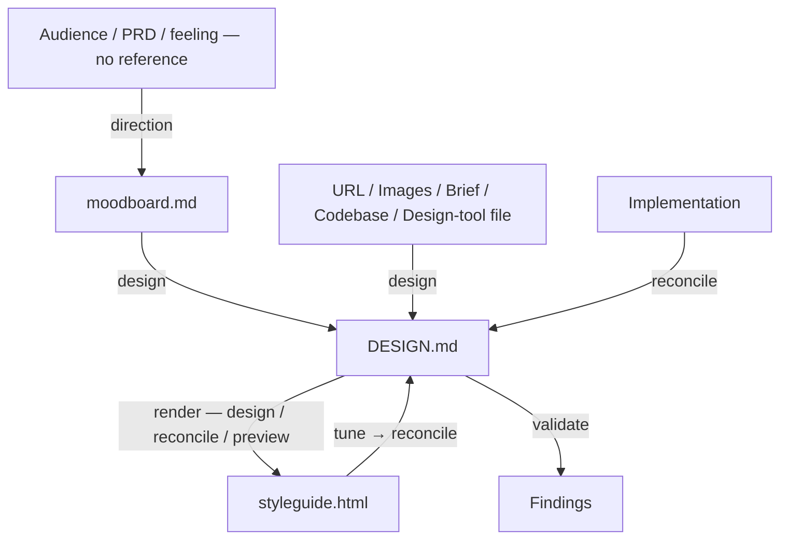

# Design Brief

Greenfield design pipeline for any digital product: explore a visual direction when none exists, then author and refine the `DESIGN.md` visual identity. DESIGN.md is the primary artifact this skill owns; `docs/design/styleguide.html` is its rendered styleguide.

## What It Does



| Step | Trigger | Output |
| ---- | ------- | ------ |
| **Direction** | No reference on hand — explore visual mood from audience/PRD, diverge across aesthetic directions, converge on one | `docs/design/moodboard.md` (locked direction: Mood, Style Axes, Signature, Touchstones) |
| **Design** | Extract design from a locked moodboard, images, codebase, brand URL, text description, or design-tool file; author or refresh `DESIGN.md` | `docs/design/DESIGN.md` (YAML frontmatter with normative tokens + prose sections narrating them) + `docs/design/styleguide.html` |
| **Preview** | `DESIGN.md` exists — render its tokens as a styleguide, tune by conversation or the optional color tuner, hand tuned deltas to reconcile | `docs/design/styleguide.html` (rendered styleguide; color tuner is a server-injected overlay) |
| **Validate** | Audit `DESIGN.md` semantics — contrast, hex validity, hierarchy, cross-section consistency | Findings report (read-only; no file writes) |
| **Reconcile** | Sync DESIGN.md from drifted implementation, or apply tuned deltas from preview | Patched `docs/design/DESIGN.md` (confirm-before-write) + `docs/design/styleguide.html` |

## What It Designs

design-brief adapts to any digital product — it does not force the project into a
fixed type. It reads the surfaces a project actually has, each under a
**register** (brand — the design is the product; or product — the design serves a
task). A project may combine several:

- **Brand surfaces** — landing pages, brand sites, campaigns, portfolios,
  long-form, about, the marketing shell of a storefront
- **Product surfaces** — app screens, dashboards, settings, forms, data tables,
  onboarding, the checkout / account flow of a storefront

Name surfaces by context; storefronts straddle the two registers. The register
sets the posture; the questions follow the surfaces present.

## Usage

```text
# Explore a visual direction when no reference exists (mood diverge/converge)
help me find a direction for this app
explore some moods, I have no reference
I'm not sure what it should feel like

# Author DESIGN.md (YAML frontmatter with normative tokens + prose narration)
extract from this screenshot
extract from this codebase
extract from https://brand.example.com
refresh DESIGN.md from this design-tool file

# Validate DESIGN.md (callable anytime, also runs as gate inside design and reconcile)
validate DESIGN.md
check this DESIGN.md
audit the design system

# Rebrand / restyle an existing app from a new reference
redesign my app with a Cyberpunk vibe
modernize this app with a Bento Grid layout
apply this brand's colors to my app, keep my typography

# Evolve the identity against the product's stated intent
does our design still fit the strategy?
align the design to the PRD
rethink the direction against PRODUCT.md

# Reconcile (brownfield drift sync: implementation back to DESIGN.md)
sync DESIGN.md from this codebase
update DESIGN.md from code
reconcile drift between implementation and design
```

## Output

```text
docs/design/
├── moodboard.md          # Locked visual direction (Mood, Style Axes, Signature) — direction-absent flow
├── DESIGN.md             # YAML frontmatter (normative tokens) + prose sections
└── styleguide.html       # Styleguide rendered from DESIGN.md
```

`docs/design/styleguide.html` is a styleguide rendered from the tokens — color swatches, type ramp, component samples. preview serves it with live-reload via `scripts/preview-server.ts`. The optional color tuner is an overlay the server injects over the styleguide (built from the color swatches); tuned values land in `DESIGN.md` via reconcile.

External design-tool files (when used as input source) live at the user's path and are user-owned. Skill never creates them.

## References

Bundled lookups auto-loaded by the relevant instruction phase:

- `references/brand.md` / `references/product.md` — register (brand vs product) posture; biases mood and token choices
- `references/aesthetics.md` — Four Questions, Style Axes, UX Heuristics, Visual Design Laws + Principles, Complexity Calibration, Creative Mandate
- `references/anti-patterns.md` — deterministic failure-mode rules; the Drift category gates DESIGN.md during validate

## Requirements

- Optional: any design-tool MCP for pull operations
- Optional: `bun` runtime for the styleguide preview server, and `python3` for the WCAG contrast checker; contrast checks fall back to manual computation when `python3` is absent

## FAQ

**Q: Greenfield or brownfield?**

A: Greenfield-first. The primary use case is starting from zero with no existing codebase. A brownfield path exists in `design.md` ("extract from codebase") for inheriting tokens at the start, for restyling an existing identity from a new reference, and for evolving it against the product's stated intent (`PRODUCT.md` / PRD), plus `reconcile.md` for syncing back after drift.

**Q: What if I have no reference or moodboard to start from?**

A: Run `direction.md` — explore a mood from scratch. It diverges across aesthetic directions (Style Axes, biased by register), converges on one, and writes `docs/design/moodboard.md`. `design` then authors `DESIGN.md` tokens from that moodboard, the same way it would from a reference. When you already have a reference (images, URL, codebase, text description), direction auto-skips and design extracts directly.

**Q: What is `DESIGN.md`?**

A: A single file at `docs/design/DESIGN.md`. A YAML frontmatter at the top carries the normative design tokens — `colors`, `typography`, `rounded`, `borderWidth`, `spacing`, `components`, `elevation`, `duration`, `easing`, `breakpoints`. Token references use `{path.to.token}` syntax inside `components`, `rounded`, and `spacing`. Below the frontmatter, H2 sections narrate the tokens in the `design.md` spec order: Overview, Colors, Typography, Layout, Elevation & Depth, Shapes, Components, Motion & Interaction, Responsive Behavior, Do's and Don'ts, Agent Prompt Guide. The frontmatter is authoritative; prose cites tokens by name in backticks (`` `primary` ``, `` `body-standard` ``, `` `rounded.lg` ``) and explains how to apply them.

**Q: Does DESIGN.md cover page layout and screen flow?**

A: No. DESIGN.md covers brand-level layout identity (spacing scale, grid container, whitespace philosophy) inside the Layout section and corner language inside Shapes. Product-specific arrangement — which pages exist, hero treatment, screen inventory, navigation pattern — is a separate layout-planning concern, not part of DESIGN.md.

**Q: Why both YAML and prose in the same file?**

A: The YAML frontmatter gives machine-readable tokens with `{path.to.token}` references that resolve into CSS custom properties without parsing prose. The prose body gives humans rationale, naming, and how-to-apply context that no token table can carry. Section-scoped patches let multiple workflow phases write into the same file without clobbering each other — the YAML is patched first, then the prose bullet that cites the same token follows so the two stay in sync.

**Q: Can I see and tune the tokens visually?**

A: Yes — run `preview.md` once `DESIGN.md` exists. It renders the tokens as a styleguide (color swatches, type ramp, component samples — the design system, not a product page) served by a local preview server with live-reload. Most tuning is conversational — say "primary too saturated" or "tighter spacing" and it patches `DESIGN.md` via `reconcile.md` (confirm-before-write), then live-reloads. Colors also get an optional interactive tuner overlay: OKLCH sliders and an optional hex input with real-time WCAG contrast. Rendering the tokens into actual product pages is a separate concern, not part of this skill.

**Q: How do I update DESIGN.md after the implementation drifted?**

A: Run `reconcile.md` — ask to sync design from implementation, update DESIGN.md from code, reconcile drift, or refresh tokens from the codebase. The skill reads current values from the implementation, diffs against the YAML frontmatter of DESIGN.md, and patches it surgically (confirm-before-write). Prose bullets that cite patched tokens are updated to match. Narrative sections (Overview, Do's and Don'ts, Agent Prompt Guide) stay untouched; the Breakpoints bullets in Responsive Behavior sync with their tokens, its narrative subsections do not. Invoke design again if narrative needs refresh.
