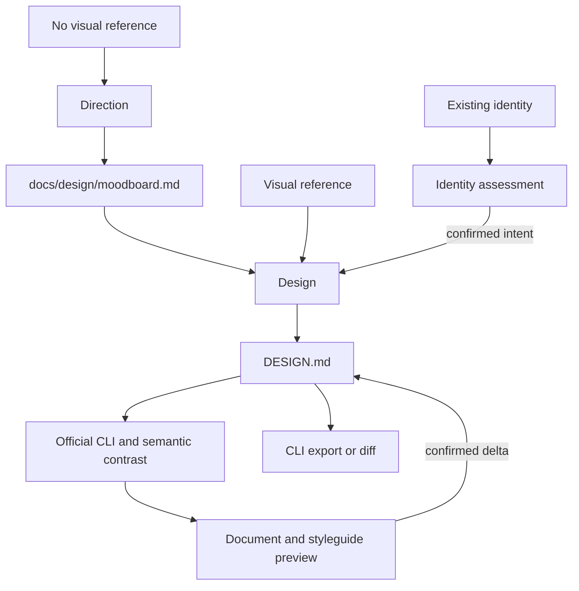

# Design Brief

Choose, assess, author, validate, and refine a visual identity in the official root `DESIGN.md` format.

## What It Does


```mermaid
flowchart TD
    A[No visual reference] --> D[Direction]
    D --> M[docs/design/moodboard.md]
    M --> W[Design]
    B[Visual reference] --> W
    C[Existing identity] --> I[Identity assessment]
    I -->|confirmed intent| W
    W --> R[DESIGN.md]
    R --> V[Official CLI and semantic contrast]
    V --> P[Document and styleguide preview]
    P -->|confirmed delta| R
    R --> E[CLI export or diff]
```

| Operation | Result |
|---|---|
| Direction | Text-only named-direction convergence and `docs/design/moodboard.md` |
| Identity assessment | Interactive findings with no report artifact or identity mutation |
| Design | Root `DESIGN.md` using the official token groups and eleven prose sections |
| Validate | `clean`, `passed with warnings`, `failed`, or `not audited` |
| Preview | On-demand `/design` and `/styleguide` with comments and temporary tuning |
| Export | Official Tailwind, DTCG, or CSS custom-property output |
| Diff | Official token changes and validation regressions |

## Usage

```text
help me find a visual direction for this product
blend Terminal Precision with Editorial Print
assess the identity in this codebase
codify the current design in DESIGN.md
refresh the identity without losing its DNA
rebrand this product from the supplied references
does the identity still fit PRODUCT.md?
sync DESIGN.md from the implementation
validate DESIGN.md
preview and tune the identity
export DESIGN.md as css-tailwind
compare DESIGN.md with the previous version
```

## Output

```text
DESIGN.md                         # only identity source, at the project root
docs/design/moodboard.md          # locked direction when exploration ran
docs/design/design.html           # explicit preview export only
docs/design/styleguide.html       # explicit preview export only
.artifacts/design/preview/        # transient views and feedback events
```

The frontmatter contains only `colors`, `typography`, `rounded`, `spacing`, and `components`, plus metadata and `omitted`. Colors are flat CSS strings. Light/dark behavior, borders, elevation, motion, and breakpoints remain prose.

## Requirements

- Node and `npx` for the official `@google/design.md` CLI.
- Python for supplemental semantic contrast.
- Bun for interactive preview.
- Optional design-tool MCP for reading an existing user-owned design file.

## FAQ

**Do CLI warnings block?**

No. Warnings produce `passed with warnings` and prevent the `clean` label. Errors block completion and downstream operations.

**Does preview write DESIGN.md?**

No interaction writes immediately. Send records one feedback batch. The agent presents a patch and writes only after explicit confirmation.

**Are preview HTML files generated by default?**

No. Preview uses transient files. Persistent `design.html` and `styleguide.html` exist only after an explicit export request.

**Does the skill migrate older output paths or schemas?**

No. The contract starts at the root `DESIGN.md`.

**Does DESIGN.md include page layout or product copy?**

No. It carries identity, tokens, layout principles, component roles, and downstream guidance. Page arrangement, screen flow, and product strings stay outside it.
