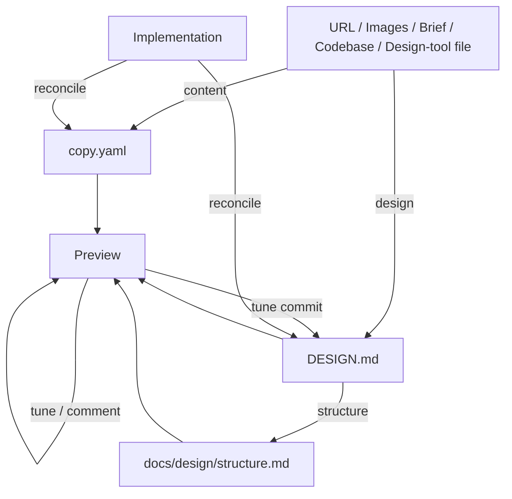

# Design Builder

Greenfield design pipeline for any digital product: extract content, author a `DESIGN.md` visual identity, define page composition or screen flow in a separate structure artifact, preview and refine designs.

## What It Does



| Step | Trigger | Output |
| ---- | ------- | ------ |
| **Content** | Extract copy from URL, web capture, brief document | `docs/design/copy.yaml` |
| **Design** | Extract design from images, codebase, brand URL, text description, or design-tool file; author or refresh `DESIGN.md` | `docs/design/DESIGN.md` (YAML frontmatter with normative tokens + numbered prose sections narrating them) |
| **Structure** | Define page composition for marketing/content surfaces, screen flow for app/dashboard screens, or catalog + commerce surfaces for storefronts | `docs/design/structure.md` (parallel artifact; never touches DESIGN.md) |
| **Preview** | Generate variants from DESIGN.md tokens + structure, tune sliders, comment inline; tuned values commit back to DESIGN.md as surgical patches | `.artifacts/design/preview/variants/` (HTML); patched `docs/design/DESIGN.md` on tune commit |
| **Redesign** | Anchor an existing app, add new external references, map slices to DESIGN.md sections, explore variants | Patched `docs/design/DESIGN.md` with slice-scoped updates |
| **Reconcile** | Brownfield: sync DESIGN.md + copy.yaml back from drifted implementation | Patched `docs/design/DESIGN.md` + `docs/design/copy.yaml` (confirm-before-write) |
| **Validate** | Audit `DESIGN.md` semantics — contrast, hex validity, hierarchy, cross-section consistency | Findings report (read-only; no file writes) |

## Three Modes

| Mode | Entry condition | Routes through |
| ---- | --------------- | -------------- |
| **Greenfield** | Zero existing design — author from raw inputs (URL, images, brief, codebase, design-tool file) | `content → design → structure → preview` |
| **Redesign** | Existing app + new external reference — map slices to DESIGN.md sections, generate variants | `redesign.md` |
| **Reconcile** | Brownfield drift — sync DESIGN.md + copy.yaml back from implementation | `reconcile.md` |

## What It Designs

design-builder adapts to any digital product — it does not force the project
into a fixed type. It reads the surfaces a project actually has, and a project
may combine several:

- **Marketing / content surfaces** — landing pages, brand sites, docs, blogs,
  product launches, conversion pages
- **App / dashboard screens** — SaaS tools, dashboards, internal tools, admin
  panels, mobile app screens
- **Storefront / commerce surfaces** — catalog, product pages, cart, checkout,
  account (online stores, DTC, marketplaces)

Name surfaces by context; the questions, presets, and structure topics follow
the surfaces present.

## Usage

### Core Pipeline

```text
# Extract content
extract copy from https://example.com
extract content from this brief (PDF/DOCX)
web capture the hero section of https://competitor.com

# Author DESIGN.md (YAML frontmatter with normative tokens + prose narration)
extract from this screenshot
extract from this codebase
extract from https://brand.example.com
refresh DESIGN.md from this design-tool file

# Validate DESIGN.md (callable anytime, also runs as gate inside design and reconcile)
validate DESIGN.md
check this DESIGN.md
audit the design system

# Redesign existing app (anchor + new external reference + slice mapping)
redesign my app with a Cyberpunk vibe
modernize this app with a Bento Grid layout
apply this brand's colors to my app, keep my typography

# Reconcile (brownfield drift sync: implementation back to DESIGN.md + copy.yaml)
sync DESIGN.md from this codebase
update DESIGN.md from code
reconcile drift between implementation and design

# Define structure (separate artifact, never touches DESIGN.md)
define the layout for this landing page         # marketing / content surface
define the screen flow for this app             # app / dashboard screens
check this wireframe                            # validate existing

# Preview
generate variants                            # N variants from DESIGN.md + structure (default 4)
generate 4 variants in editorial preset      # apply named tone from presets.md
generate 6 variants of bento + duotone       # compose across Style Axes (aesthetics.md)

# Refinement on chosen variant
tune the design         # single-token: spacing, saturation, typography contrast, radius
                        # preset: font character, motion intensity, density, decoration
# Alt+click any element in preview to comment

# Tune commits back to DESIGN.md as surgical patches after user approval
```

### Full Greenfield Pipeline

```text
1. extract copy from https://competitor.com
2. extract design from [paste screenshots]
3. define the structure (or screen flow)
4. generate variants
5. tune / comment until approved
6. hand DESIGN.md + structure.md + copy.yaml to implementation
```

Preview HTML is a decision aid — variant outputs that inform tuning and
can feed back to DESIGN.md or copy.yaml via reconcile. The handoff to
implementation is the artifact set (`DESIGN.md`, `structure.md`,
`copy.yaml`), not the rendered HTML.

## Output

```text
docs/design/
├── DESIGN.md             # YAML frontmatter (normative tokens) + numbered prose sections
├── structure.md          # Product arrangement, screen flow, or commerce surfaces
└── copy.yaml             # Structured content payload (optional)

.artifacts/design/
└── preview/
    └── variants/         # Variants HTML + .events session log
```

External design-tool files (when used as input source) live at the user's path and are user-owned. Skill never creates them.

## References

Bundled lookups auto-loaded by the relevant instruction phase:

- `references/aesthetics.md` — Four Questions, Style Axes, UX Heuristics, Visual Design Laws + Principles, Complexity Calibration, Creative Mandate
- `references/web-standards.md` — implementation rules for HTML and React (accessibility, focus, forms, motion, performance)
- `references/presets.md` — pre-blended named tones with token recipes, prompt addendum, layout hints, signature move
- `references/anti-patterns.md` — deterministic failure-mode rules across typography, color, layout, decoration, component states, motion, accessibility, performance, hydration, and drift, each with HTML fail/pass examples

## Requirements

- Bun (for preview server)
- Optional: any design-tool MCP for pull operations

## FAQ

**Q: Is this for landing pages only?**

A: No. design-builder adapts to any digital product — marketing pages, app and dashboard screens, storefronts, and more. The surfaces a project has route the questions asked and the presets offered in preview.

**Q: Greenfield or brownfield?**

A: Greenfield-first. The primary use case is starting from zero with no existing codebase. A brownfield path exists in `design-brief.md` ("extract from codebase") for inheriting tokens at the start, `reconcile.md` for syncing back after drift, plus `redesign.md` for anchor + new-reference slice-mapped pivots.

**Q: What is `DESIGN.md`?**

A: A single file at `docs/design/DESIGN.md` with two layers. A YAML frontmatter at the top carries the normative design tokens — `colors`, `typography`, `rounded`, `spacing`, `components`, `elevation`, `duration`, `easing`, `breakpoints`. Token references use `{path.to.token}` syntax inside `components`, `rounded`, and `spacing`. Below the frontmatter, numbered H2 sections narrate the tokens: Visual Theme & Atmosphere, Color Palette & Roles, Typography Rules, Component Stylings, Layout Principles, Shapes, Elevation & Depth, Motion & Interaction, Responsive Behavior, Do's and Don'ts, Agent Prompt Guide. The frontmatter is authoritative; prose cites tokens by name in backticks (`` `primary` ``, `` `body-standard` ``, `` `rounded.lg` ``) and explains how to apply them.

**Q: Where do page composition and screen flow live?**

A: In `docs/design/structure.md`, a separate artifact owned by `structure.md`. DESIGN.md covers brand-level layout identity (spacing scale, grid container, whitespace philosophy) inside the Layout section and corner language inside Shapes. Product-specific arrangement (which pages exist, hero treatment, screen inventory, navigation pattern, primary actions per screen) lives in the structure artifact.

**Q: Why both YAML and prose in the same file?**

A: The YAML frontmatter gives the preview renderer machine-readable tokens with `{path.to.token}` references that resolve into CSS custom properties without parsing prose. The prose body gives humans rationale, naming, and how-to-apply context that no token table can carry. Section-scoped patches let multiple workflow phases write into the same file without clobbering each other — the YAML is patched first, then the prose bullet that cites the same token follows so the two layers stay in sync.

**Q: Do I need a design-tool MCP?**

A: No. Default preview is HTML via a local Bun server. A design-tool MCP is optional and only used as an input source (pull tokens from a user-owned design-tool file).

**Q: How do I update DESIGN.md after the implementation drifted?**

A: Run `reconcile.md` — ask to sync design from implementation, update DESIGN.md from code, reconcile drift, or refresh tokens from the codebase. The skill reads current values from the implementation, diffs against the YAML frontmatter of DESIGN.md and (when present) `copy.yaml`, and patches both surgically (confirm-before-write). Prose bullets that cite patched tokens are updated to match. Narrative sections (Visual Theme & Atmosphere, Do's and Don'ts, Agent Prompt Guide, Responsive Behavior) stay untouched; invoke design again if narrative needs refresh.
