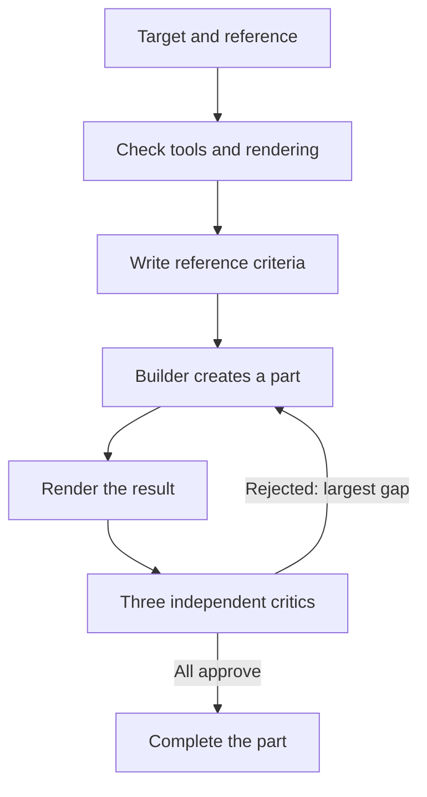

# Design Loop

Create or improve a visual artifact through construction and independent critique against a concrete reference.

## What It Does



| Phase | Output |
| --- | --- |
| Target and checks | A concrete reference and a workable rendering path |
| Criteria | 5 to 9 observable mechanisms from the reference |
| Build and judge | A rendered result, three verdicts, and one gap to fix when rejected |
| State | Global round count and progress for each part |

## Usage

Ask for a design loop around a specific page, video, presentation, or document. Provide the goal, a reference, and any existing design system or base files. The skill can create a new artifact or improve an existing one.

```text
Run a design loop for this landing page using the supplied reference and design system.
Create a presentation at the level of this reference deck and keep iterating until the critics approve it.
```

The loop has no default round limit. You can stop it or set a limit. The builder and critics inherit the session's model and effort unless you choose otherwise.

## Output

```text
.artifacts/design/<slug>/
├── reference-criteria.md
└── STATE.md
```

The created artifact remains at the output path agreed for the task. The skill's state files stay in the local agent workspace.

## Requirements

The agent needs a way to open the reference, render the result, and create independent agents with fresh context. The visual critic needs to inspect the rendered evidence.
