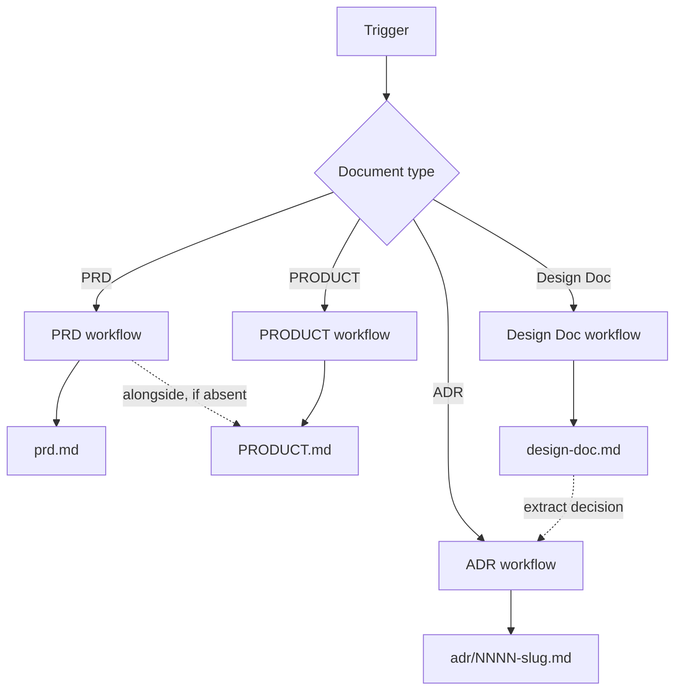

# Docs Writer

Generates structured product and technical documents through guided discovery.

## What It Does

Routes document creation requests to type-specific workflows, each with
appropriate discovery depth:



| Type | Workflow | Output |
|------|----------|--------|
| **PRD** | discovery → validation → synthesis → drafting | `prd.md` |
| **PRODUCT** | generated alongside PRD by default, or standalone | `PRODUCT.md` |
| **Design Doc** | discovery (5 topics) → analysis → drafting | `design-doc.md` |
| **ADR** | context → validation → drafting (single decision, append-only) | `adr/NNNN-slug.md` |

## Usage

```text
create PRD for my project
create design doc for my project
create ADR for switching from REST to gRPC
write requirements for the new feature
update design doc with new component
```

The skill detects the document type from the trigger and loads the
appropriate workflow.

## Output

Documents are saved by category under `docs/`:

```text
docs/product/prd.md
docs/product/PRODUCT.md
docs/tech/design-doc.md
docs/adr/{NNNN}-{slug}.md
```

Committed by default. Product-side artifacts (PRD, PRODUCT) live as
siblings of the brainstorming output (`docs/product/brainstorm.md`).
The Design Doc lives under `docs/tech/` as a single living document
per project. ADRs accumulate in their own subdirectory as a numbered
append-only log; design doc Alternatives rows link to ADRs via the
`Record` column once formalized.

## Document Boundaries

Four document types, four distinct audiences and scopes. Mixing them is the most common source of bloated, hard-to-review docs.

| Doc | Audience | Owns | Never carries |
|-----|----------|------|---------------|
| **PRODUCT** | PMs, designers, marketing | Strategic positioning: register, audience posture, brand personality, anti-references, design principles | Requirements, scope, metrics, journeys, technical content |
| **PRD** | PMs, engineers, designers | Product spec: problem, personas, scope MoSCoW, journeys, business rules, NFRs (as targets, not mechanisms) | Architecture, tech stack, APIs, UI components, framework choices |
| **Design Doc** | Engineers, future engineers | Technical strategy: domain, conventions, architecture, security, observability, testing, deployment, trade-offs | Product KPIs, personas, business rule restatement, journey walkthroughs |
| **ADR** | Engineers, future engineers | One accepted technical decision with context, consequences, alternatives | Multiple decisions in one file, open trade-offs, advocacy as context |

### How they relate

- PRODUCT is the product's strategic positioning — generated alongside the PRD by default (shared discovery), and also authored standalone when strategy shifts.
- PRD is the source of truth for product; Design Doc links to it, never copies prose.
- Design Doc captures living trade-offs; matured decisions extract into ADRs. The design doc Alternatives row keeps history via the `Record` column.
- ADRs are immutable once accepted; supersede with a new ADR, never edit.

When a section feels like it belongs in two docs, it usually belongs in one and gets a link from the other.

## FAQ

**Q: Why is there a single Design Doc per project instead of one per component or feature?**
A: The Design Doc is a living technical document that follows the
project lifecycle. Per-component or per-feature technical plans
fragment the source of truth and force traceability ceremony that
the ADR canon already solves: decisions that span scope are recorded
as ADRs, while the Design Doc keeps the narrative history through
the Alternatives Considered table. The model mirrors Google's
"Design Docs at Google" pattern with an explicit ADR linkage layer.

**Q: How does the Design Doc lifecycle work?**
A: Frontmatter `status` tracks the doc: `draft → accepted →
in-progress → shipped → superseded`. The doc evolves in place during
draft and accepted; structural updates continue through in-progress
as implementation reveals new structure; once shipped, incremental
updates are allowed but major rewrites spawn a new `design-doc-v2.md`
that supersedes the original via frontmatter.

**Q: How are ADRs linked to the Design Doc?**
A: The Design Doc's Alternatives Considered table includes a
`Record` column. Each row starts with `—` (design-doc-only record).
When a decision matures, extract it into an ADR; the row's `Record`
is updated to `ADR-NNNN`, and the ADR's References section links
back to the design doc section anchor. ADR-linked rows are frozen;
reversals create a superseding ADR and a new row, never an edit to
the original row.

**Q: When should I use an ADR vs a Design Doc?**
A: The Design Doc is the project's living technical document — it
carries the narrative of trade-offs across the project's lifetime.
The Alternatives Considered table is where decisions get explored
and recorded. Each row starts with `Record = —`; when a decision
matures, extract it into an ADR (immutable, numbered, one decision
per file), update the row's `Record` to `ADR-NNNN`, and link the
ADR's References back to the design doc anchor. ADRs are the
formal receipt; the Design Doc keeps the surrounding context.

**Q: I have decisions buried in a PRD or research — how do I lift
them into ADRs?**
A: Trigger an ADR workflow. The Context phase scans existing PRD and
Design Doc artifacts for embedded decisions (constraints, NFR
rationale, Alternatives Considered rows with `Record = —`) and lists
candidates. Each decision becomes its own ADR — one decision per
file, never a single ADR summarizing many.

**Q: Why is PRODUCT generated alongside the PRD?**
A: PRODUCT captures the product's strategic positioning — what it is
and stands for — which the same discovery surfaces while defining the
PRD. Generating it alongside means positioning is never forgotten. It
also has a standalone trigger, because positioning changes with strategy,
independent of any PRD revision.

**Q: How is the Design Doc sized?**
A: No tier-based sizing. The Google convention applies informally:
mini design docs (1-3 pages) for early-stage or single-service
projects where many section 3 sub-sections are N/A; larger design
docs (10-20 pages) for multi-service, multi-team, or
production-critical projects where most sub-sections are populated.
Section presence is "include when applicable" — sub-sections under
3 are explicitly marked `N/A` with a one-line reason, or omitted.

**Q: What if the user has no PRD when starting a Design Doc?**
A: The Design Doc workflow can start from scratch. When a PRD exists
at `docs/product/prd.md`, the discovery phase extracts product
context as input and the Context section links to it. Without a PRD,
the discovery phase widens the System Overview topic to capture
product framing alongside the technical surface.
