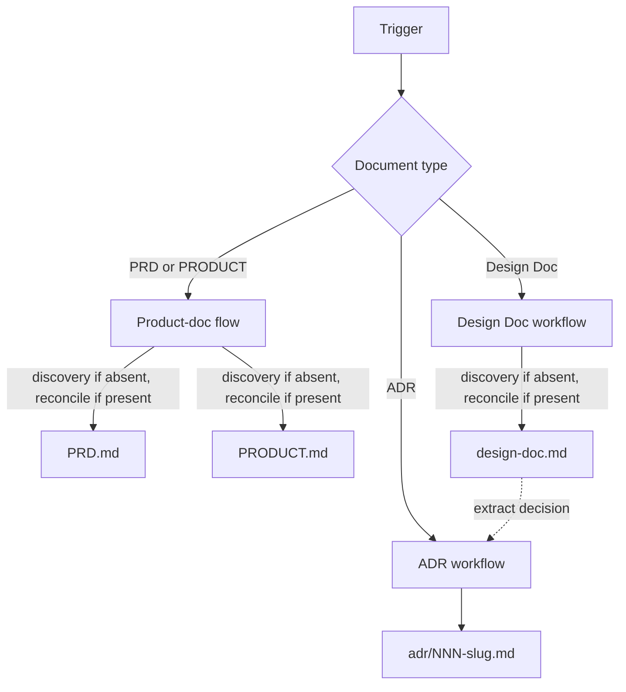

# Docs Writer

Generates structured product and technical documents through guided discovery.

## What It Does

Routes document creation requests to type-specific workflows, each with
appropriate discovery depth:



| Type | Workflow | Output |
|------|----------|--------|
| **PRD** | discovery (4 phases) if absent, reconcile if present | `PRD.md` |
| **PRODUCT** | discovery if absent, reconcile if present (per artifact) | `PRODUCT.md` |
| **Design Doc** | if absent: discovery (4 topics) → analysis → drafting; reconcile if present | `design-doc.md` |
| **ADR** | context → validation → drafting (single decision, append-only) | `adr/NNN-slug.md` |

## Usage

```text
create PRD for my project
create design doc for my project
create ADR for switching from REST to gRPC
write requirements for the new feature
update design doc with new component
```

The skill detects the document type from the trigger and loads the
appropriate workflow.

## Output

Documents are saved by category under `docs/`:

```text
docs/product/PRD.md
docs/product/PRODUCT.md
docs/tech/design-doc.md
docs/adr/{NNN}-{slug}.md
```

Committed by default. Product-side artifacts (PRD, PRODUCT) live under
`docs/product/`. The Design Doc lives under `docs/tech/`. ADRs accumulate in their own
subdirectory as a numbered append-only log; design doc Alternatives
rows link to ADRs via the `Record` column once formalized.

## Document Boundaries

Four document types, four distinct audiences and scopes. Mixing them is the most common source of bloated, hard-to-review docs.

| Doc | Audience | Owns | Never carries |
|-----|----------|------|---------------|
| **PRODUCT** | PMs, designers, marketing | Strategic positioning: register, audience posture, brand personality, anti-references, design principles | Requirements, scope, metrics, journeys, technical content |
| **PRD** | PMs, engineers, designers | Product spec: problem, personas, scope MoSCoW, journeys, business rules, NFRs (as targets, not mechanisms) | Architecture, tech stack, APIs, UI components, framework choices |
| **Design Doc** | Engineers, future engineers | The technical design and the trade-offs behind it — context, design, alternatives | Product KPIs, personas, journey walkthroughs, exhaustive spec coverage |
| **ADR** | Engineers, future engineers | One accepted technical decision with context, consequences, alternatives | Multiple decisions in one file, open trade-offs, advocacy as context |

### How they relate

- PRODUCT is the product's strategic positioning — resolved by the product-doc flow per artifact state: drafted in discovery (shared with the PRD when both are new) if absent, reconciled if it already exists, including on its own when only positioning shifts.
- PRD is the source of truth for product; Design Doc links to it, never copies prose.
- Design Doc carries the design and its trade-offs; matured decisions extract into ADRs, tracked via the Alternatives `Record` column.
- ADRs become immutable once accepted and committed; supersede with a new ADR, never edit committed history.

When a section feels like it belongs in two docs, it usually belongs in one and gets a link from the other.

## FAQ

**Q: How are ADRs linked to the Design Doc?**
A: The Design Doc's Alternatives Considered table includes a
`Record` column. Each row starts with `—` (design-doc-only record).
When a decision matures, extract it into an ADR; the row's `Record`
is updated to `ADR-NNN`, and the ADR's References section links
back to the design doc section anchor. ADR-linked rows are frozen;
reversals create a superseding ADR and a new row, never an edit to
the original row.

**Q: When should I use an ADR vs a Design Doc?**
A: The Design Doc carries the design and the trade-offs behind it; the
Alternatives Considered table is where decisions get explored and
recorded. Each row starts with `Record = —`; when a decision matures,
extract it into an ADR (immutable, numbered, one decision per file),
update the row's `Record` to `ADR-NNN`, and link the ADR's References
back to the design doc's Alternatives Considered section. ADRs are the
formal receipt; the Design Doc keeps the surrounding context.

**Q: I have decisions buried in a PRD or research — how do I lift
them into ADRs?**
A: Trigger an ADR workflow. The Context phase scans existing PRD and
Design Doc artifacts for embedded decisions (constraints, NFR
rationale, Alternatives Considered rows with `Record = —`) and lists
candidates. Each decision becomes its own ADR — one decision per
file, never a single ADR summarizing many.

**Q: How does PRODUCT relate to the PRD?**
A: PRODUCT captures the product's strategic positioning — what it is
and stands for — which the same discovery surfaces while defining the
PRD, so a new product drafts both together. After that, each is resolved
by its own state: positioning changes with strategy, so a reconcile can
touch PRODUCT alone, independent of any PRD revision.

**Q: What happens when I re-run over an existing PRD, PRODUCT, or Design Doc?**
A: Each artifact is resolved by whether it exists. A present one is
reconciled — read as input, with only the gap or the change you ask for
reworked, the delta scrutinized, and the sections taken as settled
declared before drafting. An absent one is drafted in discovery (the PRD
and PRODUCT seed each other; the Design Doc has no sibling). Existing work
is never silently overwritten.

**Q: How is the Design Doc sized?**
A: No tier-based sizing — as long as the design needs, as short as it
allows. A few decisions on a small service is a one-pager; a
multi-service system with many trade-offs runs longer. The doc grows
with the decisions, never with a section checklist.

**Q: What if the user has no PRD when starting a Design Doc?**
A: The Design Doc workflow can start in discovery with no PRD yet. When a PRD exists
at `docs/product/PRD.md`, the discovery phase extracts product
context as input and the Context section links to it. Without a PRD,
the discovery phase widens the Context & Goals topic to capture
product framing together with the technical surface.
