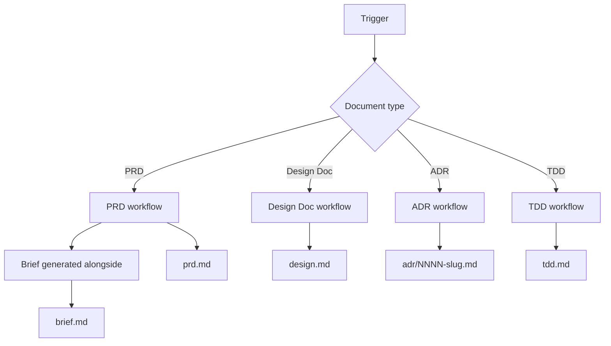

# Docs Writer

Generates structured product and technical documents through guided discovery.

## What It Does

Routes document creation requests to type-specific workflows, each with
appropriate discovery depth:



| Type | Workflow | Output |
|------|----------|--------|
| **PRD** | discovery → validation → synthesis → drafting | `prd.md` |
| **Brief** | generated alongside PRD (no standalone trigger) | `brief.md` |
| **Design Doc** | discovery → analysis → drafting (informal trade-off discussion) | `design.md` |
| **ADR** | context → validation → drafting (single decision, append-only) | `adr/NNNN-slug.md` |
| **TDD** | discovery → analysis → drafting (auto-sized core/medium/large) | `tdd.md` |

## Usage

```text
create PRD for my project
create design doc for API gateway
create ADR for switching from REST to gRPC
create TDD for payment service
write requirements for the new feature
```

The skill detects the document type from the trigger and loads the
appropriate workflow.

## Output

All documents are saved to:

```text
.artifacts/docs/{type}.md
.artifacts/docs/adr/{NNNN}-{slug}.md
```

ADRs accumulate in their own subdirectory as a numbered append-only
log.

## FAQ

**Q: When should I use a Design Doc vs a TDD?**
A: Design Docs are informal documents focused on trade-offs and
decision-making for ambiguous problems. TDDs are prescriptive plans for
specific components — they tell the team exactly what to build, with
what stack, and how to deploy. A project can have both: a Design Doc
for system-level decisions and TDDs for component-level technical
planning.

**Q: When should I use an ADR vs a Design Doc?**
A: Design Doc explores multiple decisions and trade-offs before a
choice is made — it's a discussion. ADR records *one* decision after
it's been made — it's a receipt. Common workflow: write a Design Doc
to evaluate options, then extract each accepted decision into its own
ADR. ADRs are short, numbered, and immutable; Design Docs are longer,
exploratory, and updated as the system evolves.

**Q: I have decisions buried in a PRD or research — how do I lift
them into ADRs?**
A: Trigger an ADR workflow. The Context phase scans existing PRD,
Design Doc, and TDD artifacts for embedded decisions (constraints,
NFR rationale, alternatives tables) and lists candidates. Each
decision becomes its own ADR — one decision per file, never a single
ADR summarizing many.

**Q: Why is the Brief generated alongside the PRD?**
A: The Brief is a 1-page narrative summary of the PRD. It distills
discovery into a story readable in under a minute, while the PRD
remains the specification. Having a separate trigger and discovery
phase would duplicate work — the data is already collected during the
PRD workflow.

**Q: How does TDD auto-sizing work?**
A: TDDs scale by project complexity: Core (7 sections, single service),
Medium (12 sections, multiple integrations or data modeling), Large
(15 sections, cross-team or production-critical). Critical sections
(Security, Deployment, Monitoring) are promoted regardless of size when
the project is payment/auth/PII, a production service, a migration, or
infrastructure.

**Q: What if the user has no PRD when starting a Design Doc or TDD?**
A: Both workflows can start from scratch. When a PRD exists at
`.artifacts/docs/prd.md`, the workflows extract product context as
starting input. Without one, the discovery phase covers both product
context and technical design.
