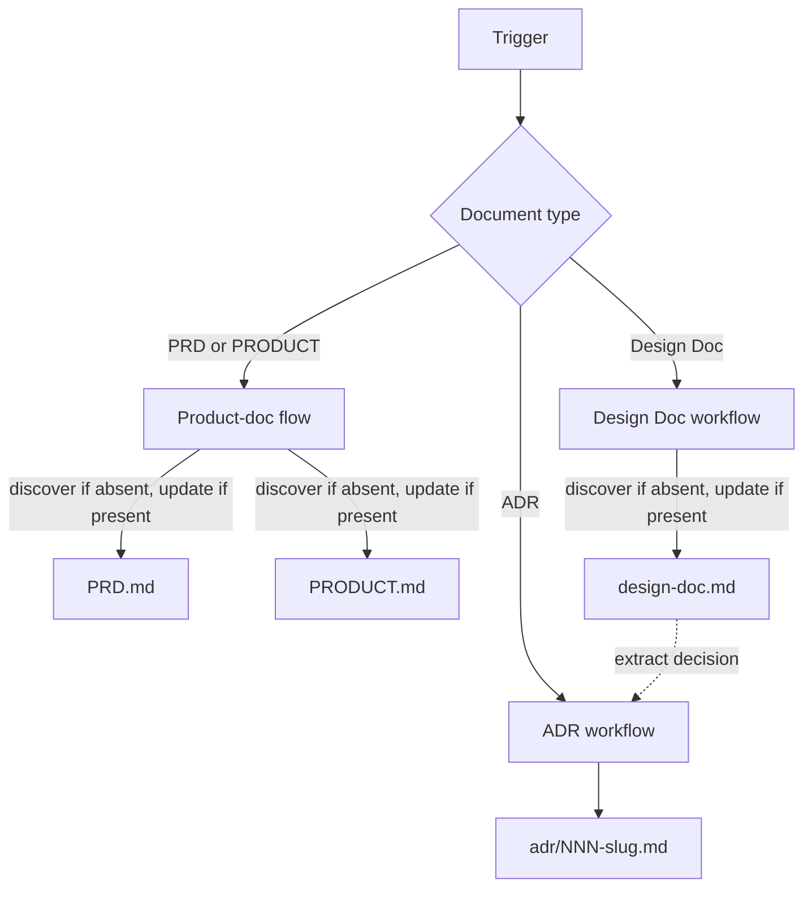

# Docs Writer

Generates structured product and technical documents through guided discovery.

## What It Does

Routes document creation requests to type-specific workflows, each with appropriate discovery depth:


```mermaid
flowchart TD
    T[Trigger] --> R{Document type}
    R -->|PRD or PRODUCT| PD[Product-doc flow]
    R -->|Design Doc| DD[Design Doc workflow]
    R -->|ADR| ADR[ADR workflow]
    PD -->|discover if absent, update if present| P[PRD.md]
    PD -->|discover if absent, update if present| PM[PRODUCT.md]
    DD -->|discover if absent, update if present| D[design-doc.md]
    ADR --> A[adr/NNN-slug.md]
    D -.->|extract decision| ADR
```

| Type | Workflow | Output |
|------|----------|--------|
| **PRD** | discovery (4 phases) if absent; update requested parts if present | `PRD.md` |
| **PRODUCT** | discovery if absent; update requested parts if present | `PRODUCT.md` |
| **Design Doc** | discovery (4 topics) → analysis → drafting if absent; update requested parts if present | `design-doc.md` |
| **ADR** | context → validation → drafting or requested update | `adr/NNN-slug.md` |

## Usage

```text
create PRD for my project
create design doc for my project
create ADR for switching from REST to gRPC
write requirements for the new feature
update design doc with new component
```

The skill detects the document type from the trigger and loads the appropriate workflow.

## Output

Documents are saved by category under `docs/`:

```text
docs/product/PRD.md
docs/product/PRODUCT.md
docs/tech/design-doc.md
docs/adr/<NNN>-<slug>.md
```

Commit documents by default. PRD and PRODUCT live under `docs/product/`. The Design Doc lives under `docs/tech/`. ADRs use numbered files under `docs/adr/`. Design Doc Alternatives rows link to ADRs through the `Record` column.

## Document Boundaries

Each document type has a distinct audience and scope. Keep their content separate so each document stays short and easy to review.

| Doc | Audience | Owns | Never carries |
|-----|----------|------|---------------|
| **PRODUCT** | PMs, designers, marketing | Strategic positioning: register, audience posture, brand personality, anti-references, design principles | Requirements, scope, metrics, journeys, technical content |
| **PRD** | PMs, engineers, designers | Product spec: problem, personas, scope MoSCoW, journeys, business rules, NFRs (as targets, not mechanisms) | Architecture, tech stack, APIs, UI components, framework choices |
| **Design Doc** | Engineers, future engineers | The technical design and the trade-offs behind it — context, design, alternatives | Product KPIs, personas, journey walkthroughs, exhaustive spec coverage |
| **ADR** | Engineers, future engineers | One technical decision with status, context, consequences, and references | Multiple decisions in one file, open trade-offs, advocacy as context |

### How they relate

- If PRODUCT does not exist, write it during discovery. If it exists, update it only when the positioning changes.
- The PRD is the main product record. The Design Doc links to the PRD instead of copying its prose.
- The Design Doc records the design and its trade-offs. When a decision becomes final, create an ADR and add its ID to the Alternatives `Record` column.
- ADRs can be updated as their record becomes clearer. When one decision replaces another, create a new ADR and mark the prior ADR as superseded.

When content appears relevant to two documents, keep it in the document that owns the subject and link to it from the other document.

## FAQ

**Q: How are ADRs linked to the Design Doc?** A: The Design Doc's Alternatives Considered table includes a `Record` column. Each row starts with `—`. When a decision becomes final, create an ADR, set the row's `Record` to `ADR-NNN`, and link the ADR back to the Design Doc section.

**Q: When should I use an ADR vs a Design Doc?** A: Use the Design Doc to examine the design and its trade-offs. Each Alternatives Considered row starts with `Record = —`. When a decision becomes final, create a numbered ADR with one decision, set the row's `Record` to `ADR-NNN`, and link the ADR back to the Design Doc.

**Q: How do I record decisions found in project documents?** A: Start an ADR workflow. The Context phase scans `CODEBASE.md`, the PRD, and the Design Doc for qualifying decisions that have no ADR. Create one ADR for each decision.

**Q: How does PRODUCT relate to the PRD?** A: PRODUCT records what the product is and stands for. The PRD records what the product does. Discovery can produce both documents for a new product. Later changes can update either document on its own.

**Q: What happens when I run the skill for an existing PRD, PRODUCT, or Design Doc?** A: The skill reads the existing document and reviews only the requested change. Before writing, it states which sections will change and which sections will remain unchanged. The skill never silently replaces existing work.

**Q: How is the Design Doc sized?** A: Keep the Design Doc as short as the design allows. A small service with a few decisions can use one page. A system with several services and trade-offs needs more detail. Add content only when a decision needs it.

**Q: What if the user has no PRD when starting a Design Doc?** A: Start Design Doc discovery without a PRD. If `docs/product/PRD.md` exists, read it for product context and link to it from Context. If no PRD exists, gather the required product context during the Context & Goals topic.
