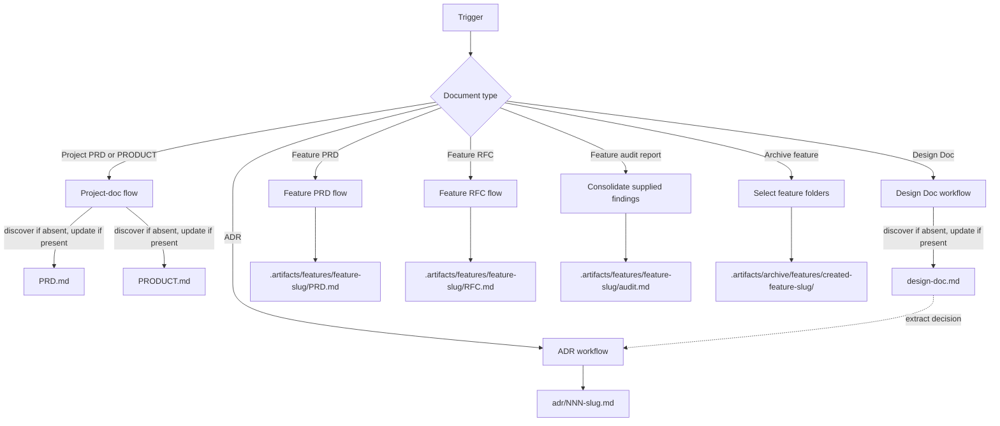

# Docs Writer

Generates structured product and technical documents through guided discovery.

## What It Does


```mermaid
flowchart TD
    T[Trigger] --> R{Document type}
    R -->|Project PRD or PRODUCT| PD[Project-doc flow]
    R -->|Feature PRD| FP[Feature PRD flow]
    R -->|Feature RFC| FR[Feature RFC flow]
    R -->|Feature audit report| FA[Consolidate supplied findings]
    R -->|Design Doc| DD[Design Doc workflow]
    R -->|ADR| ADR[ADR workflow]
    R -->|Archive feature| AR[Select feature folders]
    PD -->|discover if absent, update if present| P[PRD.md]
    PD -->|discover if absent, update if present| PM[PRODUCT.md]
    DD -->|discover if absent, update if present| D[design-doc.md]
    ADR --> A[adr/NNN-slug.md]
    FP --> FPM[.artifacts/features/feature-slug/PRD.md]
    FR --> FRM[.artifacts/features/feature-slug/RFC.md]
    FA --> FAM[.artifacts/features/feature-slug/audit.md]
    AR --> ARM[.artifacts/archive/features/created-feature-slug/]
    D -.->|extract decision| ADR
```

| Type | Output |
|------|--------|
| **Project PRD** | `PRD.md`, from a three-phase discovery when absent, or with only the requested parts updated when present |
| **Feature PRD** | `.artifacts/features/<feature-slug>/PRD.md`, from a focused discovery, or with only the requested parts updated when present |
| **Feature RFC** | `.artifacts/features/<feature-slug>/RFC.md`, from a proposal discovery, or with only the requested parts updated when present |
| **Feature audit report** | `.artifacts/features/<feature-slug>/audit.md`, consolidated from supplied findings, or with only the requested parts updated when present |
| **PRODUCT** | `PRODUCT.md`, from discovery when absent, or with only the requested parts updated when present |
| **Design Doc** | `design-doc.md`, from discovery (4 topics), analysis, and drafting when absent, or with only the requested parts updated when present |
| **ADR** | `adr/NNN-slug.md`, from context, validation, and drafting, or with the requested update applied |
| **Archive feature** | each feature folder picked from a multi-select list, moved whole to `.artifacts/archive/features/<created>-<feature-slug>/` |

## Usage

```text
create PRD for my project
create PRODUCT.md with the positioning for my project
create a feature PRD for saved searches
write an RFC for bulk export
consolidate these audit findings for saved searches
create the feature PRD and RFC for team invitations
create design doc for my project
create ADR for switching from REST to gRPC
write requirements for the new feature
upload the feature PRD to the Linear issue
update design doc with new component
archive the saved searches feature
```

## Output

Project documents are saved at the project root and by category under `docs/`:

```text
PRODUCT.md
docs/product/PRD.md
docs/tech/design-doc.md
docs/adr/<NNN>-<slug>.md
```

Feature documents are temporary artifacts:

```text
.artifacts/features/<feature-slug>/PRD.md
.artifacts/features/<feature-slug>/RFC.md
.artifacts/features/<feature-slug>/audit.md
.artifacts/archive/features/<created>-<feature-slug>/
```

Project documents live under `docs/` and ADRs remain permanent records under `docs/adr/`. Feature PRDs, RFCs, and audit reports are temporary and live under `.artifacts/features/`; the archive operation moves a whole feature folder to `.artifacts/archive/features/` when it is no longer active.

When the repository `AGENTS.md` or `CLAUDE.md` names Linear in its `## Issue tracker` section and the conversation carries a Linear issue, a feature PRD or RFC can live as a document on that issue, titled `PRD: <Feature Name>` or `RFC: <Feature Name>`, with no frontmatter. An upload request moves the local file to the issue and deletes it after the document reads back intact. Later edits go to the document on the issue.

## Requirements

The Linear MCP server is optional. Without it, feature documents stay under `.artifacts/features/`.

## FAQ

**Q: When should I use an ADR vs a Design Doc, and how are they linked?** A: Use the Design Doc to examine the design and its trade-offs. Each row of its Alternatives Considered table starts with `Record = —`. When a decision becomes final, create a numbered ADR with one decision, set the row's `Record` to `ADR-NNN`, and link the ADR back to the Design Doc section.

**Q: How do I record decisions found in project documents?** A: Start an ADR workflow. The Context phase scans `PROJECT.md`, the PRD, and the Design Doc for qualifying decisions that have no ADR. Create one ADR for each decision.

**Q: How does PRODUCT relate to the PRD?** A: PRODUCT records what the product is and stands for. The PRD records what the product does. Discovery can produce both documents for a new product. Later changes can update either document on its own.

**Q: What happens when I run the skill for an existing PRD, PRODUCT, or Design Doc?** A: The skill reads the existing document and reviews only the requested change. After writing, it states what changed and where. The skill never silently replaces existing work.

**Q: Can a feature have a PRD, an RFC, or both?** A: Yes. When both are requested, the feature PRD is written first and the RFC links to it without duplicating its content.

**Q: What does the audit report do?** A: It consolidates findings supplied from other audit tools into one report. It preserves their evidence and status; it does not run an audit or implement fixes.

**Q: How is the Design Doc sized?** A: Keep the Design Doc as short as the design allows. A small service with a few decisions can use one page. A system with several services and trade-offs needs more detail. Add content only when a decision needs it.

**Q: What if the user has no PRD when starting a Design Doc?** A: Start Design Doc discovery without a PRD. If `docs/product/PRD.md` exists, read it for product context and link to it from Context. If no PRD exists, gather the required product context during the Context & Goals topic.

**Q: What content stays out of each document?** A: PRODUCT carries strategic positioning and no requirements or technical content. The PRD carries the product specification and no architecture, tech stack, APIs, UI components, or framework choices. The Design Doc carries the technical design and its trade-offs and links to the PRD instead of copying its prose. An ADR carries one decision. The audit report carries supplied findings and no independently validated claims or inferred severity. Content relevant to two documents stays in the one that owns the subject, and the other links to it.

**Q: What happens when a decision recorded in an ADR is replaced?** A: Create a new ADR and mark the prior ADR as superseded. An ADR can still be updated when its record needs correction or clarification.
