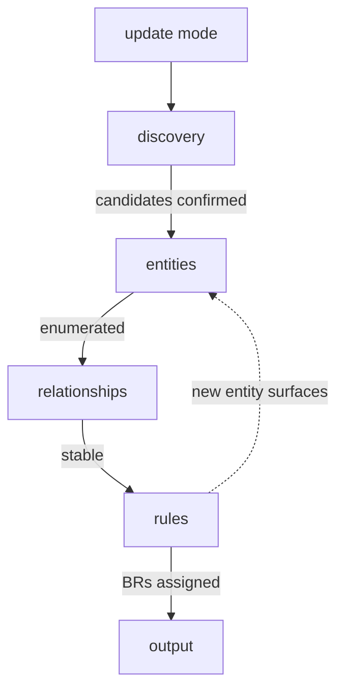

# Domain Model

Translate product requirements into a formal domain language for the whole team.

## What It Does



Dashed arrow: relationships may surface a missing entity, looping back.
`update mode` enters at discovery when an implementation gap is reported.

| Phase | Output |
|-------|--------|
| Discovery | Candidate entities with PRD source references |
| Entities | Attributes, invariants, lifecycle per entity |
| Relationships | Cardinalities, aggregate roots, bounded contexts, context map |
| Rules | All BR-N assigned to entity lifecycle |
| Output | `domain.md` in `.artifacts/docs/` |

## Usage

```
build the domain model for this product
define entities from the PRD
map domain bounded contexts
what are the entities in this domain
update domain model — gap found
```

## Output

```
.artifacts/docs/domain.md
```

## Requirements

- A PRD artifact at `.artifacts/docs/prd.md` (or a path provided by the user)
- Optional: `.agents/knowledge.md ## Domain Gaps` section for update mode
