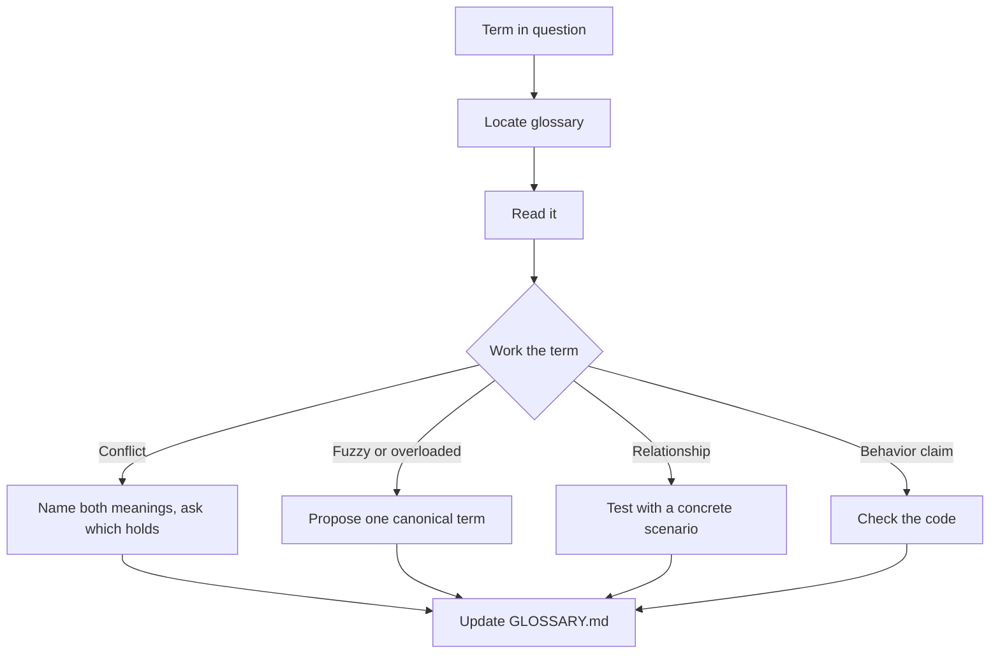

# Domain Modeling

Keep one canonical term per domain concept and write each resolution into `GLOSSARY.md`.

## What It Does



| Phase | What Happens | Output |
|-------|-------------|--------|
| Locate | Root `GLOSSARY.md`, or none yet | Target glossary |
| Work the term | Challenge conflicts, sharpen vague words, probe edge cases, cross-check code | Resolved term |
| Write | Update the entry as soon as the term resolves | Edited `GLOSSARY.md` |

## Usage

```text
we call these customers and clients interchangeably, which one is right
what should we name this concept
rename "account" to "customer" in the glossary
the code says "order" but the docs say "purchase"
add this term to the glossary
```

## Output

```text
GLOSSARY.md
```

The file is created at the first resolved term, never ahead of it.

## FAQ

**Q: What belongs in the glossary?** A: Terms specific to this project's domain. General programming concepts and implementation detail stay out.

**Q: What happens to a term that is still open?** A: It stays out of the file until it resolves.
