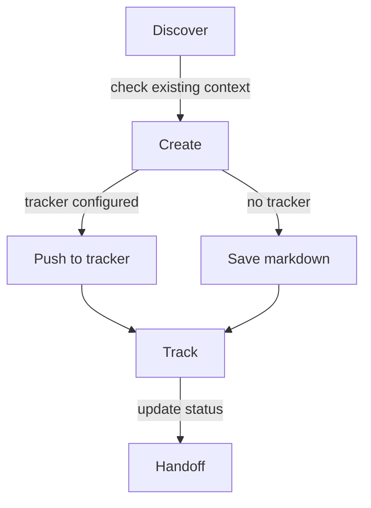

# Epic Tracker

Manages the delivery lifecycle from epic planning through story tracking to implementation handoff.

## What It Does



When a tracker is configured (via MCP or CLI), artifacts go directly to
the tracker — no local files created. When no tracker is configured,
markdown in `.artifacts/epics/` is the source of truth.

| Phase | What Happens | Output |
|-------|-------------|--------|
| Discover | Check for existing PRD, brief, or context | Context for artifact creation |
| Create | Generate epic, story, bug, issue, or release | Tracker entity or markdown artifact |
| Track | Update status in tracker when configured, in markdown otherwise | Updated state |
| Handoff | Surface tracker URLs and prepare for implementation | User picks next step |

## Tracker Integration

| Artifact | Linear | GitHub Issues | GitHub Projects | Jira |
|----------|--------|---------------|-----------------|------|
| Epic     | Project | Milestone | Issue parent (sub-issues) | Epic |
| Story    | Issue | Issue | Sub-issue | Story |
| Bug      | Issue + label `bug` | Issue + label `bug` | Sub-issue + label `bug` | Bug |
| Issue    | Issue + label `task` | Issue + label `task` | Sub-issue + label `task` | Task |
| Release  | Cycle | Release tag | Release tag | Fix Version |

Release uses each tracker's closest native primitive instead of forcing
one concept.

Configure via `configure tracker` (runs bootstrap once) or by editing
`.artifacts/epics/.config.yml` directly. Bootstrap detects available
MCPs and CLIs; both are supported. When no integration is detected, the
skill stays in markdown-only mode.

## Usage

```
create epic                -- plan a new epic with stories, scope, and acceptance criteria
create story               -- add a user-facing story to an existing epic
edit story                 -- update an existing Story; AC changes re-validate
report bug                 -- document a defect with reproduction steps and severity
create issue               -- file an internal work item (infra, refactor, tooling, research)
create release             -- group stories across epics for delivery
show roadmap               -- display delivery status overview
mark done                  -- update artifact status
sync to tracker            -- push current artifact to configured tracker
pull from tracker          -- refresh markdown with latest tracker state
configure tracker          -- run bootstrap to set or change tracker config
handoff                    -- prepare story for implementation
```

## Story Acceptance Criteria

Stories enforce Given/When/Then 1:1 acceptance criteria. Each AC is a
`### AC-N` block with one Given, one When, one Then — no compound
clauses. The skill validates on Story create and on edits that change
AC text. Stories created before this convention are not retroactively
validated.

## Output

Markdown files created only when no tracker is configured (or user
declines push).

```
.artifacts/epics/
├── .config.yml             # tracker config (created by bootstrap)
├── epic-name/
│   ├── epic.md
│   ├── 001-story-name.md
│   ├── bug-name.md
│   └── issue-name.md
├── standalone/
│   ├── bug-name.md
│   └── issue-name.md
└── releases/
    └── release-name.md
```

## Requirements

- Optional: tracker MCP or CLI for push/pull operations (Linear, GitHub, Jira)
- Falls back to markdown-only when no integration is available

## FAQ

**Q: Do I have to use a tracker?**
A: No. Without a tracker configured (`tracker.kind: none` or no config),
markdown in `.artifacts/epics/` is the source of truth. All workflows
work without an external system.

**Q: How do I switch trackers?**
A: Run `configure tracker`. Bootstrap re-detects available MCPs/CLIs and
updates the config. Existing artifacts keep their `tracker.id` from the
previous tracker; you can manually attach to the new tracker by editing
the frontmatter or by re-creating the artifact.

**Q: What happens when I push and the tracker is unavailable?**
A: The push fails, your markdown stays untouched, and the skill suggests
retry. No partial state is left in the tracker.

**Q: Why are stories numbered (`001-story-name.md`)?**
A: The numeric prefix gives a stable order within an epic folder. The
prefix is filename-only — the artifact's `name` field stays clean
(`story-name`).

**Q: Can a bug or issue exist outside an epic?**
A: Yes. Standalone bugs and issues live in `.artifacts/epics/standalone/`.
When the work later grows into a thematic epic, you can move and
re-link.
