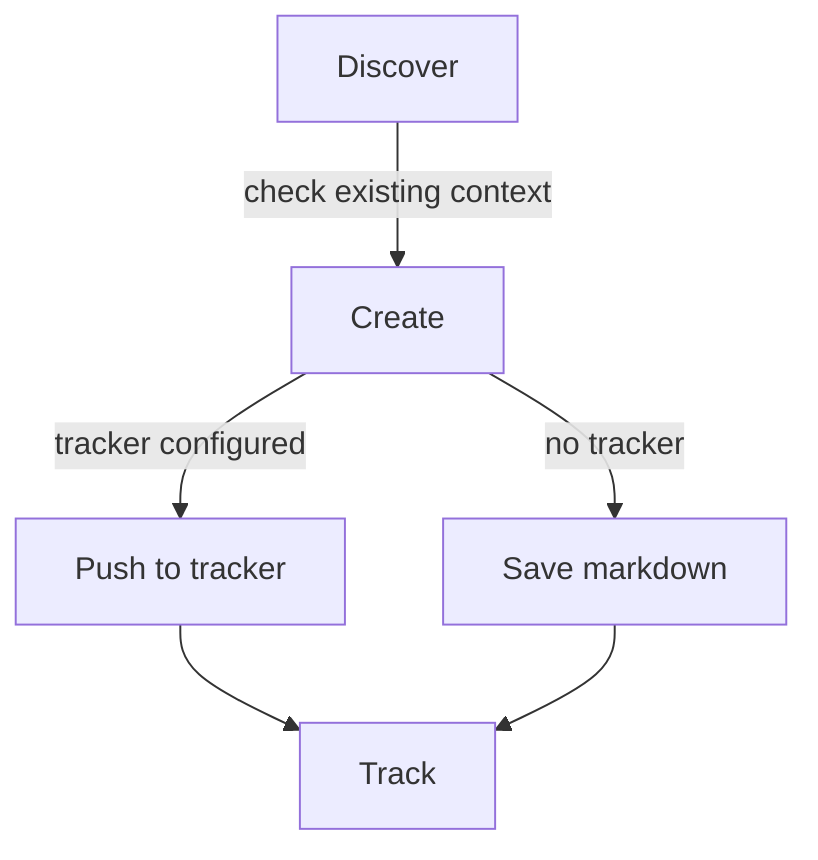

# Epic Tracker

Manages the delivery lifecycle from epic planning through story tracking.

## What It Does



When a tracker is configured (via MCP or CLI), artifacts go directly to the tracker — no local files created. When no tracker is configured, markdown in `.artifacts/epics/` is the source of truth.

| Phase | What Happens | Output |
| ----- | ------------ | ------ |
| Discover | Check for existing PRD, brief, or context | Context for artifact creation |
| Create | Generate epic, story, bug, or task | Tracker entity or markdown artifact |
| Track | Update status in tracker when configured, in markdown otherwise | Updated state |

## Tracker Integration

| Artifact | Linear | GitHub |
| -------- | ------ | ------ |
| Epic | Project | Issue (parent) |
| Story | Issue | Issue (sub-issue of Epic) |
| Bug | Issue + label `bug` | Issue (sub-issue of Epic/Story or standalone) |
| Task | Issue + label `task` | Issue (sub-issue of Epic or standalone) |

GitHub uses sub-issues as the hierarchy primitive. Projects v2 is an orthogonal opt-in layer (custom fields/views) — it does not encode Epic→Story.

Configure via `configure tracker` (runs bootstrap once). Bootstrap detects available MCPs and CLIs; both are supported. Config is stored in `git config --local`. When no integration is detected, the skill stays in markdown-only mode.

## Dependencies

Any epic, story, bug, or task can declare `blocked_by` — the artifacts that must finish first, referenced as tracker ids/URLs when a tracker is configured or as local paths otherwise. When a tracker is configured, this maps to its native dependency relation (GitHub issue dependencies, Linear issue relations); in markdown-only mode the frontmatter field is the source of truth and surfaces in the overview. Only `blocked_by` is stored — the inverse is derived, and the tracker keeps both sides in sync.

## Usage

```text
create roadmap             -- organize epics into an ordered flow in docs/ROADMAP.md
create epic                -- plan a new epic with stories and scope
decompose                  -- materialize a roadmap into epics, or an epic into stories/tasks
create story               -- add a story (a demonstrable slice of user value) to an existing epic
edit story                 -- update an existing Story; AC changes re-validate
report bug                 -- document a defect with reproduction steps and severity
create task                -- file a general work item (infra, refactor, tooling, research, ...)
list epics                 -- show the delivery overview
mark done                  -- update artifact status
sync to tracker            -- push current artifact to configured tracker
pull from tracker          -- refresh markdown with latest tracker state
configure tracker          -- run bootstrap to set or change tracker config
```

## Story Acceptance Criteria

Stories enforce Given/When/Then 1:1 acceptance criteria. Each AC is a `### AC-N` block with one Given, one When, one Then — no compound clauses — plus an optional `**Satisfies**` line linking the parent-epic requirement it operationalizes. The skill validates on Story create and on edits that change AC text. Validation also flags a Then that promises more than the story's Summary requires — a timing, count, threshold, or mechanism the outcome does not need — for a loosen-or-keep decision. Stories created before this convention are not retroactively validated.

## Requirement Traceability

The **epic** declares the PRD requirement IDs it owns (`FR/BR/EC/NFR`) in a `## Requirements` section, read from the PRD via its PRD link. Each **story** operationalizes them: every `### AC-N` links the requirement it satisfies on a `**Satisfies**` line, which the spec inherits 1:1 downstream. A **task** carries no requirement IDs — it is AC-less work measured by its `## Definition of Done`. `ADR-NNN` is a decision dependency recorded in References, not a requirement. Requirement coverage is an epic↔story relationship: every requirement the epic declares is operationalized by ≥1 story AC.

## Roadmap

The roadmap organizes the project's epics into an ordered flow, derived from the PRD, in the committed doc `docs/ROADMAP.md`. `create roadmap` writes and updates this living plan in place; `decompose` materializes it into epics (and an epic into stories and tasks). The roadmap is local — there is no tracker mirror. Epics stay self-contained: they never reference the roadmap.

## Output

The roadmap lives in the committed doc `docs/ROADMAP.md`, separate from `.artifacts/epics/`. The rest are markdown files created only when no tracker is configured, or when a request asks to keep an artifact local.

```text
.artifacts/epics/
├── epic-name/
│   ├── epic.md
│   ├── 001-story-name.md
│   ├── bug-name.md
│   └── task-name.md
└── standalone/
    ├── bug-name.md
    └── task-name.md
```

## Requirements

- Optional: tracker MCP or CLI for push/pull operations (Linear, GitHub)
- Falls back to markdown-only when no integration is available

## FAQ

**Q: Do I have to use a tracker?** A: No. Without a tracker configured (`epic-tracker.kind: none` or unset), markdown in `.artifacts/epics/` is the source of truth. All workflows work without an external system.

**Q: Am I asked before every push?** A: No. Bootstrap asks once per project and stores the answer in `epic-tracker.kind`. After that, creates follow the config without re-asking. Name a destination in the request to override it for a single artifact — "create the issue on GitHub" pushes even when the config says `none`, and "save this locally" skips the push even when a tracker is configured. Neither rewrites the config; only `configure tracker` does.

**Q: How do I switch trackers?** A: Run `configure tracker`. Bootstrap re-detects available MCPs/CLIs and updates git config. Existing artifacts keep their `tracker.id` from the previous tracker; you can manually attach to the new tracker by editing the frontmatter or by re-creating the artifact.

**Q: What happens when I push and the tracker is unavailable?** A: The push fails, your markdown stays untouched, and the skill suggests retry. No partial state is left in the tracker.

**Q: Why are stories numbered (`001-story-name.md`)?** A: The numeric prefix gives a stable order within an epic folder. The prefix is filename-only — the artifact's `name` field stays clean (`story-name`).

**Q: Can a bug or task exist outside an epic?** A: Yes. Standalone bugs and tasks live in `.artifacts/epics/standalone/`. When the work later grows into a thematic epic, you can move and re-link.
