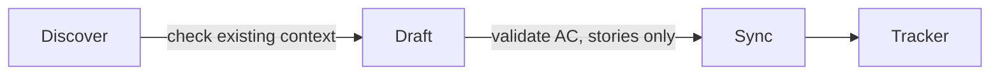

# Epic Tracker

Manages the delivery lifecycle from epic planning through story tracking, in an external tracker.

## What It Does



Every artifact lives in the tracker — Linear or GitHub, via MCP or CLI. Nothing is written locally, and the tracker is the single source of truth. A tracker is required: without one configured, bootstrap runs first and nothing is created until it completes.

| Phase | What Happens | Output |
| ----- | ------------ | ------ |
| Discover | Check for existing PRD, roadmap, or context | Context for the draft |
| Draft | Compose epic, story, bug, or task to its canonical template | Body + dispatch inputs |
| Sync | Dispatch to the tracker via its adapter | Tracker entity + URL |

## Tracker Integration

| Artifact | Linear | GitHub |
| -------- | ------ | ------ |
| Epic | Project | Issue (parent) |
| Story | Issue | Issue (sub-issue of Epic) |
| Bug | Issue + label `bug` | Issue (sub-issue of Epic/Story or standalone) |
| Task | Issue + label `task` | Issue (sub-issue of Epic or standalone) |

GitHub uses sub-issues as the hierarchy primitive. Projects v2 is an orthogonal opt-in layer (custom fields/views) — it does not encode Epic→Story.

Configure via `configure tracker` (runs bootstrap once per project). Bootstrap detects the available MCPs and CLIs; both channels are supported, and one falls back to the other. Config is stored in `git config --local`, so it stays with the project.

## Dependencies

Any epic, story, bug, or task can declare `blocked_by` — the artifacts that must finish first, as tracker ids or URLs. It maps to the tracker's native dependency relation (GitHub issue dependencies, Linear issue relations). Only `blocked_by` is stored — the inverse is derived, and the tracker keeps both sides in sync.

## Usage

```text
create roadmap             -- organize epics into an ordered flow in docs/ROADMAP.md
create epic                -- plan a new epic with scope and requirements
decompose                  -- materialize a roadmap into epics, or an epic into stories/tasks
create story               -- add a story (a demonstrable slice of user value) to an existing epic
edit story                 -- update an existing story; AC changes re-validate
report bug                 -- document a defect with reproduction steps and severity
create task                -- file a general work item (infra, refactor, tooling, research, ...)
list epics                 -- show the delivery overview from the tracker
mark done                  -- update artifact status in the tracker
configure tracker          -- run bootstrap to set or change tracker config
```

## Story Acceptance Criteria

Stories enforce Given/When/Then 1:1 acceptance criteria. Each AC is a `### AC-N` block with one Given, one When, one Then — no compound clauses — plus an optional `**Satisfies**` line linking the parent-epic requirement it operationalizes. The skill validates on story create and on edits that change AC text, before any tracker round-trip. Resolving each `Satisfies` against the parent epic also flags a Then that promises what the requirement never asked for — a timing, count, threshold, or mechanism with no source — so the story does not quietly owe more than the requirement demands. Artifacts already in the tracker are not retroactively validated when read.

## Requirement Traceability

The **epic** declares the PRD requirement IDs it owns (`FR/BR/EC/NFR`) in a `## Requirements` section, read from the PRD via its PRD link. Each **story** operationalizes them: every `### AC-N` links the requirement it satisfies on a `**Satisfies**` line, which the spec inherits 1:1 downstream. A **task** carries no requirement IDs — it is AC-less work measured by its `## Definition of Done`. `ADR-NNN` is a decision dependency recorded in References, not a requirement. Requirement coverage is an epic↔story relationship: every requirement the epic declares is operationalized by ≥1 story AC.

## Roadmap

The roadmap organizes the project's epics into an ordered flow, derived from the PRD, in `docs/ROADMAP.md`. `create roadmap` writes and updates this living plan in place; `decompose` materializes it into epics (and an epic into stories and tasks). It is optional — a local planning aid, never mirrored to the tracker, and committing it is the user's call. Epics stay self-contained: they never reference the roadmap.

## Output

Artifacts live in the tracker; the skill writes no local files for them. The roadmap is the one exception — `docs/ROADMAP.md`, a local planning document.

## Requirements

- **Required:** a tracker — Linear or GitHub — reachable through an MCP server or its CLI (`gh`, `linear`). Without one, no artifact can be created.

## FAQ

**Q: Do I have to use a tracker?** A: Yes. The tracker is the single source of truth; the skill keeps no local copy of an epic, story, bug, or task. When no MCP or CLI is detected, bootstrap stops and tells you what to set up.

**Q: Am I asked before every push?** A: No. Bootstrap asks once per project and stores the answer in `epic-tracker.kind`. After that, creates follow the config without re-asking. Name a destination in the request to override it for a single artifact — "create the issue on GitHub" when the config says Linear. The override never rewrites the config; only `configure tracker` does. It does not apply to a story, whose parent epic lives in the configured tracker.

**Q: How do I switch trackers?** A: Run `configure tracker`. Bootstrap re-detects the available MCPs and CLIs and updates the git config. Artifacts already created stay in the old tracker — the switch applies to what you create next.

**Q: What happens when I push and the tracker is unavailable?** A: The skill tries the fallback channel (CLI when MCP fails, or the reverse). When both are down, it holds the draft in the session, surfaces the error, and offers to retry — the drafted content is never discarded. No partial state is left in the tracker.

**Q: What if someone edits the issue while I'm editing it here?** A: Every write to an existing artifact refetches immediately before it lands. When the tracker moved underneath, the skill surfaces the divergence and asks before overwriting — a teammate's edit is never silently destroyed.

**Q: Can a bug or task exist outside an epic?** A: Yes. Standalone means no parent epic — the artifact is created without an `epic_id`. Stories always have a parent epic.
