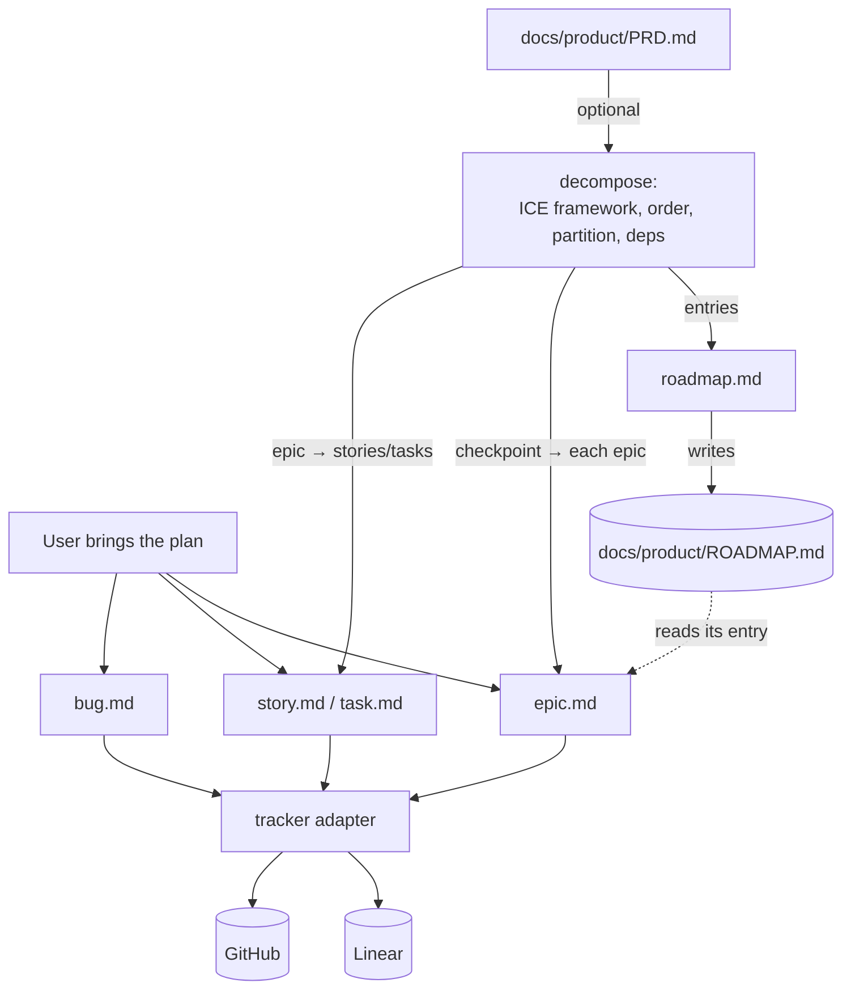

# Epic Tracker

Manages the delivery lifecycle from roadmap and epic planning through story tracking, in an external tracker.

## What It Does


```mermaid
flowchart TD
    USER[User brings the plan] --> EP[epic.md]
    USER --> STK[story.md / task.md]
    USER --> BG[bug.md]
    PRD[docs/product/PRD.md] -->|optional| DEC[decompose:<br>ICE framework, order, partition, deps]
    DEC -->|entries| RW[roadmap.md]
    RW -->|writes| RM[(docs/product/ROADMAP.md)]
    DEC -->|checkpoint → each epic| EP
    RM -.reads its entry.-> EP
    DEC -->|epic → stories/tasks| STK
    EP --> SY[tracker adapter]
    STK --> SY
    BG --> SY
    SY --> LN[(Linear)]
    SY --> GH[(GitHub)]
```

Every artifact is drafted by its create ref — `epic.md`, `story.md`, `task.md`, `bug.md` — and dispatched through the tracker adapter; the plan usually comes from the user directly. `decompose` is the optional planning ceremony in front: given a PRD it derives the epic set, writes it to the roadmap through `roadmap.md`, and — after a checkpoint — feeds each epic to `epic.md`, then each story and task to `story.md`/`task.md`. `roadmap.md` only writes the record; it decides nothing. A story's acceptance criteria are validated before anything reaches the tracker whatever the plan's source; a bug hangs under an epic or stands alone, always created directly.

Every artifact lives in the tracker — Linear via MCP, GitHub via MCP or the `gh` CLI. Nothing but the roadmap is written locally, and the tracker is the single source of truth for state. A tracker is required: without one configured, bootstrap runs first and nothing is created until it completes. `docs/product/ROADMAP.md` is the one local file — committed, alongside `PRD.md` and `PRODUCT.md`.

| Phase | What Happens | Output |
| ----- | ------------ | ------ |
| Discover | Epic only — read the PRD, PRODUCT, and this epic's roadmap entry | Context for the draft |
| Draft | Compose epic, story, bug, or task to its canonical template | Body + dispatch inputs |
| Sync | Dispatch to the tracker via its adapter | Tracker artifact + URL |

## Tracker Integration

| Artifact | Linear | GitHub |
| -------- | ------ | ------ |
| Epic | Issue (parent) | Issue (parent) |
| Story | Issue (sub-issue of Epic, or standalone) | Issue (sub-issue of Epic, or standalone) |
| Bug | Issue (sub-issue of Epic, or standalone) | Issue (sub-issue of Epic, or standalone) |
| Task | Issue (sub-issue of Epic, or standalone) | Issue (sub-issue of Epic, or standalone) |

Every artifact is an Issue, and sub-issues carry the hierarchy in both trackers. Each one classifies the artifact type its own way (a Linear label, a GitHub issue type or label). On GitHub, Projects v2 is an orthogonal opt-in layer for board views and custom fields.

Configure via `configure tracker` (runs bootstrap once per project). Bootstrap detects what is reachable: GitHub through MCP or the `gh` CLI, with one falling back to the other; Linear through MCP alone. Config is stored in `git config --local`, so it stays with the project.

## Status

An artifact is `planned`, `in-progress`, `done`, or `cancelled`. It holds exactly one at a time, and each adapter maps it to the tracker's own vocabulary in both directions — Linear by workflow-state type, GitHub by open/closed plus its state reason.

`done` and `cancelled` both close the artifact and say different things: `done` is delivered, `cancelled` is dropped. Work abandoned rather than finished is `cancelled`, so the tracker never reports it as shipped.

Closing an epic speaks for everything under it. When a story, bug, or task beneath it is still open, the skill says how many and asks before closing — and never closes a child to make the epic's status true.

Blocked is not a status. Work can be started and waiting on another artifact at the same time, so waiting is carried by `blocked_by` — see below.

## Priority

Any epic, story, bug, or task can carry a priority — `urgent`, `high`, `medium`, or `low` — mapped to the tracker's own surface: Linear's native priority field, GitHub's Projects v2 Priority field or a priority label.

It is stated, never derived. Give one and it travels; say nothing and the artifact carries none, which every tracker shows as unprioritized. Priority does not cascade from an epic to its children, and nothing infers it from severity, from dependencies, or from an epic's place in the roadmap.

Severity and priority are separate on a bug: severity is how badly the defect breaks the product, priority is when the team picks it up.

## Estimate

A story, bug, or task can carry an estimate — a number in whatever scale the tracker is already set up for: Linear's native estimate field, a number field on a GitHub Project. An epic carries none; its size is the roll-up of its children, and a number on the epic too is a second answer reports add to that one.

Estimation is opt-in and never prompted. Say a number and it travels; say nothing and the artifact carries none. The skill never estimates on your behalf — not from the count of acceptance criteria, not from scope, not from severity.

The scale stays yours. A t-shirt size or a range is settled with you before the push, because only your team's scale says which number it is.

On GitHub the estimate needs `epic-tracker.project` and a number field on that Project — without one there is nowhere to put it, so the skill says so and creates the artifact without it.

## Dependencies

Any epic, story, bug, or task can declare `blocked_by` — the artifacts that must finish first, as tracker ids or URLs. It maps to the tracker's native dependency relation (GitHub issue dependencies, Linear issue relations), which both trackers surface in their own UI. Only `blocked_by` is stored — the inverse is derived, and the tracker keeps both sides in sync.

The artifact body carries a `## Dependencies` section showing both directions, because whoever opens the issue reads the description, not the relations panel. It is a rendering, not the record: the skill rewrites it on every write to the artifact. `Blocks` moves when another artifact declares a dependency on this one, which is a write elsewhere — so it is current as of this artifact's last write, and the tracker's panel is what is live.

Dependencies are editable for the life of the artifact, not just at creation: "block this on ENG-42", "unblock this".

## Usage

```text
create roadmap             -- derive the epic set from the PRD, write docs/product/ROADMAP.md, then materialize
create epic                -- draft one epic directly — you bring the plan, PRD optional
decompose                  -- run the ceremony: PRD into a roadmap of epics, or an epic into stories/tasks
create story               -- add a story (a demonstrable slice of user value) to an existing epic
edit story                 -- update an existing story; AC changes re-validate
report bug                 -- document a defect with reproduction steps and severity
create task                -- file a general work item (infra, refactor, tooling, research, ...)
list epics                 -- show the delivery overview from the tracker
mark done                  -- update artifact status in the tracker
cancel this                -- drop an artifact that will not be delivered
move this to epic X        -- reparent a story, bug, or task under another epic
block this on X            -- record a dependency on an existing artifact
configure tracker          -- run bootstrap to set or change tracker config
```

## Artifact Bodies

Each artifact is drafted to a fixed set of sections. A section marked optional is present when it has something to say and absent when it does not — an empty one is a result, never a placeholder to fill.

| Artifact | Sections |
| -------- | -------- |
| Epic | Summary, Scope, Success Criteria*, Requirements*, Open Questions*, Dependencies*, References |
| Story | Summary, Out of Scope*, Acceptance Criteria, Open Questions*, Dependencies*, References* |
| Task | Summary, Definition of Done, Dependencies*, References* |
| Bug | Summary, Signals*, Steps to Reproduce, Expected, Actual, Impact, Environment*, Workaround, Regression*, Dependencies* |

What is worth knowing about the shapes:

- **A story opens with its declaration** — `As a {role}, I want {capability}, so that {benefit}` — and the role is the same actor its acceptance criteria name in their Given. Prose after it carries only what the declaration does not.
- **An epic states how it will be judged.** `Success Criteria` are observed after it ships and gate nothing; `Requirements` are what has to hold. An epic still closes on its children.
- **A bug reads in the order it happened** — the steps first, then what should have happened and what did. The steps also say how reliably they fire: `always`, `intermittently`, or `once`.
- **References hold only what the tracker cannot model** — design docs, UI links, decisions, and for a task the source it came from. The parent epic and every dependency are tracker relations, so they are never lines in the body; a field with nothing to point at is omitted rather than filled with "None".
- **Hierarchy is never a list in a body.** Child artifacts live in the tracker's own sub-issue panel.

## Story Acceptance Criteria

Stories enforce Gherkin acceptance criteria. Each AC is a `### AC-N` block with a fenced ```` ```gherkin ```` scenario and an optional `**Satisfies**` line linking it to the parent-epic requirement it operationalizes. Use `Scenario` for single cases and `Scenario Outline` + `Examples` for parametrized cases; `And` and `But` may continue any step. The skill validates on story create and on edits that change AC text, before any tracker round-trip. Resolving each `Satisfies` against the parent epic also flags a Then that promises what the requirement never asked for — a timing, a count, a threshold, a mechanism, or an outcome beyond the one it names — so the story does not quietly owe more than the requirement demands. Past five criteria the skill asks whether the story is really one outcome — a confirm, never a block, and the one size check every story gets whether it came from `decompose` or straight from you. Artifacts read from the tracker are not validated.

## Requirement Traceability

The **epic** declares the PRD requirement IDs it owns (`FR/BR/EC/NFR`) in a `## Requirements` section, read from the PRD via its PRD link. Each **story** operationalizes them: every `### AC-N` links the requirement it satisfies on a `**Satisfies**` line, which the spec inherits 1:1 downstream. A **task** is AC-less work measured by its `## Definition of Done`, and a done-condition carries the same link when it discharges a requirement no story can — typically an `NFR` or `BR` delivered by work nobody observes. `ADR-NNN` is a decision dependency recorded in References, not a requirement. Requirement coverage runs from the epic to its children: every requirement it declares is operationalized by ≥1 `Satisfies`, on a story AC or a task done-condition. A standalone story or task sits under no epic, so it carries no `Satisfies` line and enters no coverage set.

## Roadmap

The roadmap is `decompose`'s record of the settled plan — the project's epics in an ordered flow, in `docs/product/ROADMAP.md`, committed alongside `PRD.md` and `PRODUCT.md`. `decompose` requires a PRD, derives the epics, and writes the roadmap through `roadmap.md`; there is no separate step that decides the plan elsewhere. Each entry carries the epic's capability, the requirement IDs it owns, and its `Blocked by` dependencies — enough for a re-run to read the plan back instead of re-deriving. Phase headings are cosmetic grouping for the reader. Epics stay self-contained: they never reference the roadmap.

## Milestones

A milestone is the tracker's grouping primitive — a Linear project milestone or a GitHub repo milestone. The skill treats it as the materialization of a roadmap phase: when `decompose` runs on a roadmap grouped into phases, each epic's phase name becomes its milestone, reusing one already in the tracker (including one created by hand in the UI) or creating it with no date. A flat roadmap assigns none.

A milestone is a property of the whole epic subtree: the epic takes its phase name, and every story, bug, and task under it mirrors the epic's milestone, so the tracker groups the epic and its children together. A standalone story, bug, or task carries none. The skill only ever assigns a milestone by deriving it from a phase — never from free text — and on a re-run it reconciles the subtree to the epic's current phase, confirming before it overwrites a milestone changed by hand. A reparent mirrors the new epic's milestone under the same guard: a hand-set milestone is confirmed before it is replaced. Scheduling and progress on the milestone stay in the tracker UI.

## Output

Artifacts live in the tracker; the skill writes no local files for them. The roadmap is the one exception — `docs/product/ROADMAP.md`, committed alongside `PRD.md` and `PRODUCT.md`.

## Requirements

- **Required:** a tracker — Linear through an MCP server, or GitHub through an MCP server or the `gh` CLI. Without one, no artifact can be created.

## FAQ

**Q: Do I have to use a tracker?** A: Yes. The tracker is the single source of truth; the skill keeps no local copy of an epic, story, bug, or task. When no MCP or CLI is detected, bootstrap stops and tells you what to set up.

**Q: Am I asked before every push?** A: No. Bootstrap asks once per project and stores the answer in `epic-tracker.kind`. After that, creates follow the config without re-asking. Name a destination in the request to override it for a single artifact — "create the issue on GitHub" when the config says Linear. The override never rewrites the config; only `configure tracker` does. It does not apply to an artifact under an epic, whose parent lives in the configured tracker; an epic or a standalone artifact carries no such constraint.

**Q: Can I create an epic, story, or task without running decompose?** A: Yes — that is the default. You bring the plan; the create ref drafts it to the canonical template and pushes to the tracker. It runs no derivation, partition, coverage, or ICE — those belong to `decompose`, the optional ceremony that derives the plan from a PRD. Creating directly works whether or not a PRD exists.

**Q: Can I plan without creating anything in the tracker?** A: Yes. `decompose` writes the roadmap first and confirms before materializing — decline the checkpoint and the plan is saved to `docs/product/ROADMAP.md` with nothing created. Run `decompose` again later to materialize.

**Q: How do I switch trackers?** A: Run `configure tracker`. Bootstrap re-detects what is reachable and updates the git config. Artifacts already created stay in the old tracker — the switch applies to what you create next.

**Q: What happens when I push and the tracker is unavailable?** A: On GitHub, the skill tries the other channel (MCP when `gh` fails, or the reverse). On Linear, which runs on MCP alone, there is no second channel. When no channel is left, it holds the draft in the session, surfaces the error, and offers to retry — the drafted content is never discarded. No partial state is left in the tracker.

**Q: What if someone edits the issue while I'm editing it here?** A: Every write to an existing artifact refetches immediately before it lands. When the tracker moved underneath, the skill surfaces the divergence and asks before overwriting — a teammate's edit is never silently destroyed.

**Q: Can a story, bug, or task exist outside an epic?** A: Yes. Standalone means no parent epic — the artifact is created without an `epic_id`. A standalone story or task carries no `Satisfies` line, since no epic declares the requirements it would link to.
