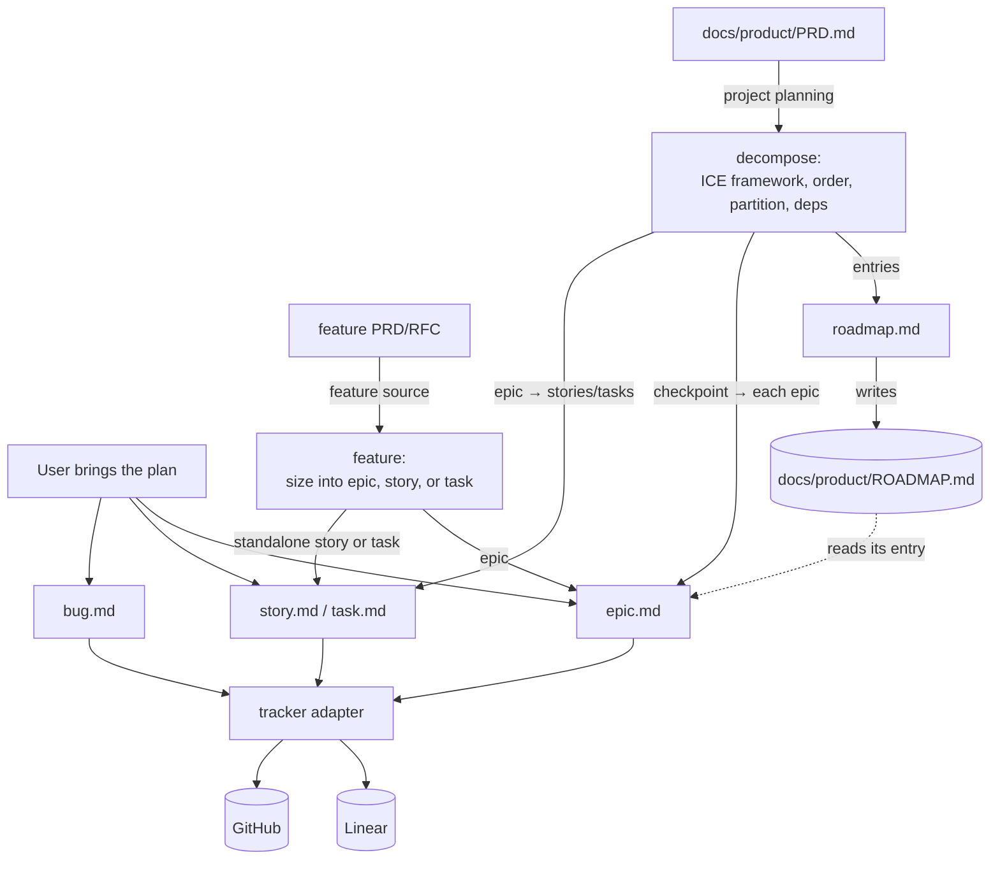

# Epic Tracker

Manages the delivery lifecycle from roadmap and epic planning through story tracking, in an external tracker.

## What It Does


```mermaid
flowchart TD
    USER[User brings the plan] --> EP[epic.md]
    USER --> STK[story.md / task.md]
    USER --> BG[bug.md]
    PRD[docs/product/PRD.md] -->|project planning| DEC[decompose:<br>ICE framework, order, partition, deps]
    FPRD[feature PRD/RFC] -->|feature source| FT[feature:<br>size into epic, story, or task]
    FT -->|epic| EP
    FT -->|standalone story or task| STK
    DEC -->|entries| RW[roadmap.md]
    RW -->|writes| RM[(docs/product/ROADMAP.md)]
    DEC -->|checkpoint → each epic| EP
    RM -.reads its entry.-> EP
    DEC -->|epic → stories/tasks| STK
    EP --> SY[tracker adapter]
    STK --> SY
    BG --> SY
    SY --> LN[(Linear)]
    SY --> GH[(GitHub)]
```

| Phase | Output |
| ----- | ------ |
| Plan | Project PRD only, through the optional `decompose`: the epic set written to `docs/product/ROADMAP.md`, then, after a checkpoint, each epic and its stories and tasks sent to Draft |
| Size | Feature PRD or RFC only, through the optional `feature`: the document cut along the epic seams into an epic (two or more units), a standalone story (one unit whose outcome a user observes), or a standalone task (otherwise); no roadmap is written |
| Discover | Epic only: context for the draft, read from the feature PRD or RFC, or from the project PRD, PRODUCT, and roadmap entry |
| Draft | Epic, story, bug, or task body composed to its canonical template, plus dispatch inputs; a story's acceptance criteria are validated before anything reaches the tracker |
| Sync | Tracker artifact and URL, dispatched through the Linear or GitHub adapter; the tracker is the single source of truth for state |

## Usage

```text
create a roadmap of epics from the PRD
break this epic into stories and tasks
create issues from this RFC
create an epic for the billing redesign
add a story to the billing epic
edit the story and update its acceptance criteria
report a bug with reproduction steps and severity
create a task to upgrade the CI runner
list epics and what is in progress
mark this story done
cancel this task because it will not be delivered
move this story to the onboarding epic
block this story on ENG-42
configure tracker
```

## Output

Artifacts live in the tracker; the skill writes no local files for them. Two files are the exception — `docs/product/ROADMAP.md`, committed alongside `PRD.md`, and the `## Issue tracker` block in `AGENTS.md` or `CLAUDE.md`.

## Requirements

- **Required:** a tracker — Linear through an MCP server, or GitHub through an MCP server or the `gh` CLI. Without one, no artifact can be created.

## FAQ

**Q: Do I have to use a tracker?** A: Yes. The tracker is the single source of truth; the skill keeps no local copy of an epic, story, bug, or task. When no MCP or CLI is detected, bootstrap stops and tells you what to set up.

**Q: Am I asked before every push?** A: No. Bootstrap asks once per project and stores the answer in `epic-tracker.kind`. After that, creates follow the config without re-asking. Name a destination in the request to override it for a single artifact — "create the issue on GitHub" when the config says Linear. The override never rewrites the config; only `configure tracker` does. It does not apply to an artifact under an epic, whose parent lives in the configured tracker; an epic or a standalone artifact carries no such constraint.

**Q: Does every feature RFC or PRD become an epic?** A: No. `feature` cuts the document along the same seams `decompose` uses on the project PRD and counts what falls out. Two or more units make it an epic; one unit whose outcome a user observes is a standalone story; one unit nobody observes is a standalone task. Document length is not a seam, and the sized result is settled with you before anything is created. The project PRD is the exception — it describes the whole product, so it always yields epics.

**Q: Can I create an epic, story, or task without running decompose?** A: Yes — that is the default. You bring the plan; the create ref drafts it to the canonical template and pushes to the tracker. It runs no derivation, partition, coverage, or ICE — those belong to `decompose`, the optional ceremony that derives the plan from a PRD. Creating directly works whether or not a PRD exists.

**Q: Can I plan without creating anything in the tracker?** A: Yes. `decompose` writes the roadmap first and confirms before materializing — decline the checkpoint and the plan is saved to `docs/product/ROADMAP.md` with nothing created. Run `decompose` again later to materialize.

**Q: How do I switch trackers?** A: Run `configure tracker`. Bootstrap re-detects what is reachable and updates the git config and the `## Issue tracker` block. Artifacts already created stay in the old tracker — the switch applies to what you create next.

**Q: What happens when I push and the tracker is unavailable?** A: On GitHub, the skill tries the other channel (MCP when `gh` fails, or the reverse). On Linear, which runs on MCP alone, there is no second channel. When no channel is left, it holds the draft in the session, surfaces the error, and offers to retry — the drafted content is never discarded. No partial state is left in the tracker.

**Q: What if someone edits the issue while I'm editing it here?** A: Every write to an existing artifact refetches immediately before it lands. When the tracker moved underneath, the skill surfaces the divergence and asks before overwriting — a teammate's edit is never silently destroyed.

**Q: Can a story, bug, or task exist outside an epic?** A: Yes. Standalone means no parent epic — the artifact is created without an `epic_id`. A standalone story or task carries no `Satisfies` line, since no epic declares the requirements it would link to.

**Q: What is the difference between done and cancelled?** A: Both close the artifact. `done` means delivered and `cancelled` means dropped, so work abandoned rather than finished is `cancelled` and the tracker never reports it as shipped. Blocked is not a status; waiting on another artifact is carried by `blocked_by`.

**Q: What happens when I close an epic that still has open children?** A: The skill says how many stories, bugs, or tasks beneath it are still open and asks before closing. It never closes a child to make the epic's status true.

**Q: Does the skill set priority or estimates for me?** A: No. Priority (`urgent`, `high`, `medium`, `low`) and estimates travel only when you state them, and nothing derives them from severity, dependencies, scope, or roadmap position. On a bug, severity is how badly the defect breaks the product and priority is when the team picks it up. An epic carries no estimate, and on GitHub an estimate needs `epic-tracker.project` and a number field on that Project, otherwise the artifact is created without it.

**Q: Can I change dependencies after an artifact is created?** A: Yes. "block this on ENG-42" and "unblock this" work for the life of the artifact. Only `blocked_by` is stored in the tracker's native relation; the `## Dependencies` section in the body is a rendering rewritten on every write, so the tracker's relations panel is what is live.

**Q: How are milestones assigned?** A: When `decompose` runs on a roadmap grouped into phases, each epic's phase name becomes its milestone, reusing an existing one or creating it with no date, and every story, bug, and task under the epic mirrors it. A flat roadmap and a standalone artifact carry none, and a milestone changed by hand is confirmed before it is overwritten.
