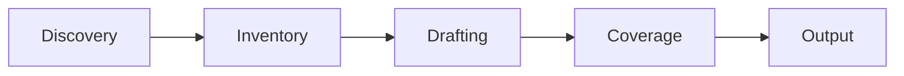

# Main Flows

Trace each PRD journey and background process through the system as a
sequence of actor steps, entity transitions, and side effects.

## What It Does

Bridge the gap between the domain model (entities, invariants,
lifecycle) and system design (architecture, components, NFRs):



| Phase | What Happens | Output |
|-------|--------------|--------|
| Discovery | Read PRD + domain.md, extract foreground (per journey) and background (per FR trigger) candidates | Candidate list |
| Inventory | Confirm list with user, group by bounded context | Confirmed flow list |
| Drafting | Fill the per-flow template (trigger, actors, main success scenario, extensions, side effects, success guarantees) | Drafted flows |
| Coverage | Build BR/EC matrix, resolve orphans, document non-exercises | Verified set |
| Output | Write the artifact and hand off downstream | `flows.md` |

## Usage

```
build main flows from the PRD
map flows for the journeys
trace journeys through the system
show how entities dance
verify flow coverage
update flows — implementation found a gap
```

## Output

```
.artifacts/docs/flows.md
```

## Requirements

- `.artifacts/docs/prd.md` — produced upstream
- `.artifacts/docs/domain.md` — produced upstream

If either input is missing, the discovery phase stops and asks for it.

## FAQ

**Q: Are Mermaid diagrams required?**
A: No — recommended for foreground journeys where the visual aids the
reader, skipped for single-actor background flows where the diagram
adds noise.

**Q: What goes in "Not Exercised by Flows"?**
A: Pure-data invariants (format constraints, enum bounds,
referential integrity) that live in entity definitions in
`domain.md`. Listing them keeps the coverage matrix honest without
forcing a flow that does not exist.

**Q: How does update mode work?**
A: When a downstream skill reports a flow gap, it writes a row to
`## Flow Gaps` in `.agents/knowledge.md`. The discovery phase reads
that queue, narrows scope to the gap, and after coverage completes,
appends a row to `## Processed Gaps`.

**Q: Can a flow span multiple bounded contexts?**
A: Yes — assign one primary context (the one that owns the
triggering entity) and list secondary contexts the flow touches.
Cross-context flows must name every context they touch.
