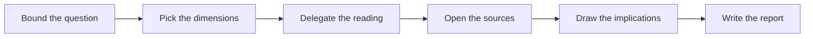

# Research

Turns one open question about a product or a codebase into sourced evidence, and leaves it as a report in the repository.

## What It Does



| Phase | Output |
| --- | --- |
| Bound the question | One question, the materials the user named, the assumptions taken |
| Pick the dimensions | The product or code dimensions the question touches, and the primary source of each |
| Delegate the reading | A background agent with the question, the dimensions, and the materials, and no conversation history |
| Open the sources | Findings marked primary, secondary, or inference, with disagreements kept apart |
| Draw the implications | What each finding changes for the project, and nothing past that |
| Write the report | `.artifacts/research/<topic>.md`, revised in place when the question already has one |

## Usage

```text
research how invoice reconciliation works in fintech back offices before we write the brief
what do competitors charge for team plans, with sources
find out how the checkout flow handles a declined card in this repo
what does the Stripe API guarantee about idempotency keys at the version we use
research the accessibility rules a public sector site in Brazil must follow
go through these interview notes and pull out what users say about onboarding
```

## Output

```text
.artifacts/research/<topic>.md
```

The report carries the question, the findings with their source level, the implications, the unknowns, the open questions, and the references. It never carries a solution, a requirement, a design, copy, or a plan.

## Requirements

Uses whatever documentation, web, or repository access the host exposes. Without any, the findings come from the materials and the repository only, and the report says so.
