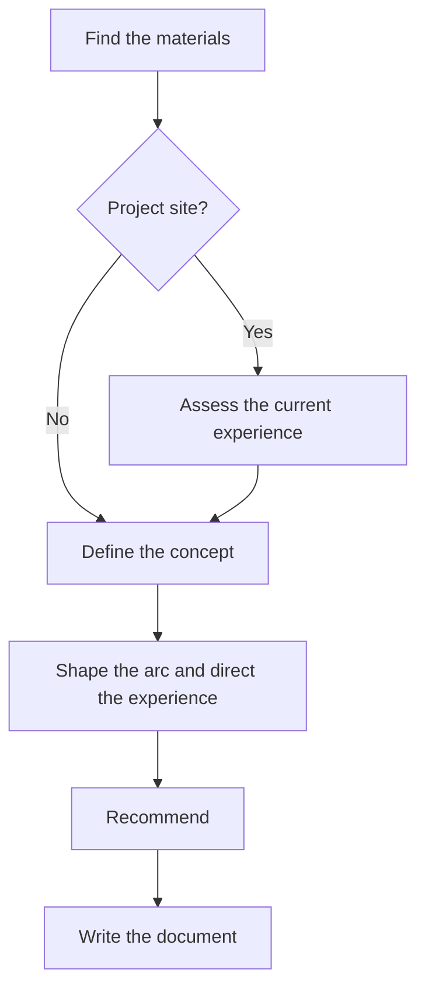

# Storytelling

Creates or revises the story and experience direction of a site: thesis, tension, arc, pacing, and the role of interaction and movement.

## What It Does



| Phase | Output |
| --- | --- |
| Find the materials | Materials matched by kind, the role of each site, the starting state |
| Assess the current experience | Evidence-backed observations from the code and the rendered pages |
| Define the concept | Thesis, tension, and feeling |
| Shape the arc | Ordered moments with intent and pace |
| Direct the experience | Rhythm, role of interaction, whether movement serves the story, visual mood in words |
| Recommend | What to preserve, what to reinterpret, conflicts with the visual identity |
| Write the document | `storytelling.md` |

The skill states intent only. Layout, visual identity values, timing, renderer, and assets belong to whoever builds, and every entry is a suggestion the builder may contest.

## Usage

```text
define the story for this site
this landing page feels generic, give it a central idea
what narrative should the home page tell
direct the experience of this site before we build it
revise the storytelling now that the pages are live
use this site as a reference for the story, not for the look
```

## Output

```text
docs/design/storytelling.md
```

A re-run revises the same file: untouched sections stay, and each recorded claim is re-checked against the new materials. The document carries `status`, `created`, and `updated` in its frontmatter. The skill writes `draft`; the user sets `agreed`.

## Requirements

- A way to render the site (optional): the skill starts a local dev server for code in the repository, or opens a published address. When rendering fails, it asks how to proceed and never assesses silently from code alone.

## FAQ

**Q: Does it need a brief or any other input?** A: No. It works from whatever exists (a work description, a visual identity, pages, code, reference sites) and asks for what is missing.

**Q: Does it change my code or visual identity?** A: No. Conflicts and changes appear as recommendations in the document.

**Q: Can it conclude that the site needs no motion or video?** A: Yes. The Movement entry records the decision and the reason, including a decision for none.
