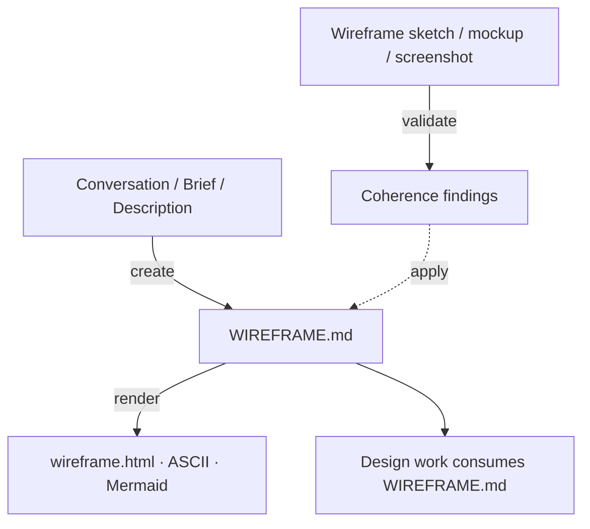

# Wireframe Sketch

Plans `WIREFRAME.md` — the design-blind layout payload a design consumes.

## What It Does



| Step | Trigger | Output |
| ---- | ------- | ------ |
| **Create** | Author a fresh layout plan from conversation — surfaces, blocks, shapes, flow | `docs/design/WIREFRAME.md` |
| **Render** | Project the region tree into a low-fi neutral view | `docs/design/wireframe.html` · ASCII · Mermaid |
| **Validate** | Check a wireframe or existing plan for IA, flow, usability heuristics, and intent coherence | Findings (patch via create, confirm-before-write) |

Arrangement is orthogonal to visual identity: the same `WIREFRAME.md` holds
independent of visual styling, so this skill plans structure only — never
colors, fonts, tokens, copy strings, or requirement IDs. It also renders the
plan low-fi and neutral — `wireframe.html`, ASCII, or a Mermaid flow — never
adding a visual identity.

Each surface is arranged under a **register** — brand (the surface communicates)
or product (the surface serves a task) — which biases the block order and shapes.
Surfaces are named by context; storefronts straddle the two registers.

Each surface is also planned for real conditions — how it reflows on narrow
viewports and how it holds real data volume (none / typical / many) — as
structural intent, never pixels.

## Usage

```text
# Create a fresh layout plan
plan the layout for this landing page
map the information architecture for this app
arrange the screens and flow from this brief
draft a wireframe plan from this brief

# Render the plan low-fi
render the wireframe
show me an ASCII sketch of this layout
draw a black-and-white wireframe
diagram the screen flow

# Validate a wireframe or existing plan
check this wireframe for coherence
does this screen flow hold up?
validate WIREFRAME.md
review the page composition before we style it
```

## Output

- `docs/design/WIREFRAME.md` — a YAML frontmatter region tree (surfaces → blocks
  with shape hints) plus a markdown body (screen map + per-surface rationale),
  derived from the conversation or a brief.
- `docs/design/wireframe.html` — the rendered low-fi neutral view, generated from
  the region tree. Regenerate after edits; never hand-edit.

## Requirements

- Python 3 for the render and validate scripts (standard library only).
- `WebFetch` for pulling a reference URL's structure (optional — sketches,
  screenshots, and described layouts work without it).
