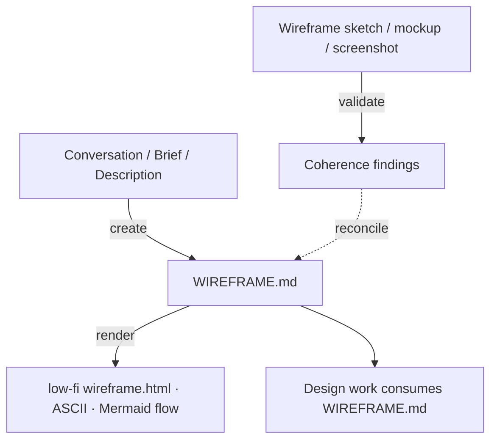

# Wireframe Sketch

Plans `WIREFRAME.md` — the structural layout a design consumes — and draws it as
a low-fi wireframe.

## What It Does



| Step | Trigger | Output |
| ---- | ------- | ------ |
| **Create** | Author a fresh layout plan from conversation — surfaces, blocks, shapes, flow | `docs/design/WIREFRAME.md` |
| **Render** | Draw the plan as a low-fi wireframe — an HTML page or an ASCII sketch — plus a Mermaid screen-flow | `docs/design/wireframe.html` · ASCII · Mermaid |
| **Validate** | Check a wireframe or plan for coherence and usability heuristics, then reconcile the plan | Findings + reconciled `WIREFRAME.md` (confirm-before-write) |

Arrangement is orthogonal to visual identity: the same `WIREFRAME.md` holds
independent of visual styling, so this skill plans structure only — never colors,
fonts, tokens, copy strings, or requirement IDs. The render is **generative and
low-fi**: it reads the plan and draws a greyscale, content-blind wireframe — bars
for text, crossed boxes for images, filled shapes for buttons — guided by a
bundled glyph kit so runs stay consistent in style.

Each surface is arranged under a **register** — brand (the surface communicates)
or product (the surface serves a task) — which biases the block order and shapes.
Surfaces are named by context; storefronts straddle the two registers.

Each surface is also planned for real conditions — how it reflows on narrow
viewports and how it holds real data volume (none / typical / many) — as
structural intent, never pixels.

## Usage

```text
# Create a fresh layout plan
plan the layout for this landing page
map the information architecture for this app
arrange the screens and flow from this brief

# Draw the plan as a low-fi wireframe
draw a low-fi wireframe of this page
render the wireframe
show me an ASCII wireframe of this layout
diagram the screen flow

# Validate a wireframe or plan, and reconcile
check this wireframe for coherence
does this screen flow hold up?
validate WIREFRAME.md and reconcile the plan
```

## Output

- `docs/design/WIREFRAME.md` — a YAML frontmatter region tree (surfaces → blocks
  with shape hints) plus a markdown body (screen map + per-surface rationale),
  derived from the conversation or a brief.
- `docs/design/wireframe.html` — the drawn low-fi wireframe, generated from the
  plan with the bundled glyph kit. Regenerate after edits; it is derived, never
  a source.

## Requirements

- No build and no external tools — the render draws with the bundled glyph kit
  (`assets/wireframe.css`).
- `WebFetch` for pulling a reference URL's structure (optional — sketches,
  screenshots, and described layouts work without it).
