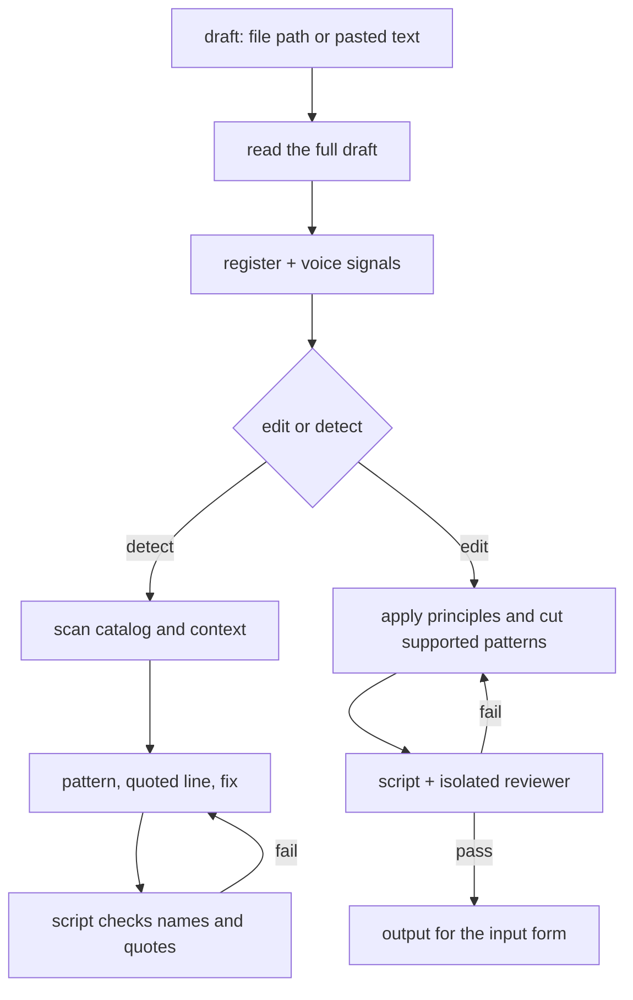

# Anti-Slop

Edits drafts into clear, natural prose, or names AI-writing patterns without changing the draft.

## What It Does



| Mode | Output |
|------|--------|
| edit | Pasted draft: the full edit plus What changed. File: the file is edited in place and the reply reports its path, a summary, open items, and What changed. Embedded: final text only, ready for another workflow |
| detect | One line per pattern found: name, quoted line, fix — nothing rewritten |

## Usage

```text
Clean up this draft, keep it sounding like me
Make this post less AI-sounding
Remove the AI-writing patterns from docs/notes/launch.md
Does this read as AI slop?
Scan this for AI tells, do not rewrite it
```

## Output

Pasted text comes back in the reply. A file path is edited in place; the reply reports the path, a short summary of the edit, any open item, and What changed, never the edited file. Embedded text comes back without a preamble or change log. The file form changes prose only and preserves code, data, frontmatter, links, identifiers, and document structure.

## Requirements

Python 3, standard library only, for the bundled check scripts.

## FAQ

**Q: Does it work in languages other than English?** A: Yes. It writes in the draft's language. The word lists are English, but the skill matches the same patterns in other languages.

**Q: Does detect tell me whether AI wrote the piece?** A: No. It names patterns and quotes the lines that carry them. It does not identify the author.

**Q: Will it flatten my voice?** A: The edit keeps distinctive words, rhythm, bluntness, humor, and digressions. It cuts only what the draft needs, so the result still sounds like the same person.

**Q: Does it add opinions or personality?** A: Not by default. Technical, reference, legal, and factual prose stays neutral and precise. Personal and editorial prose can keep personality when the source supports it.

**Q: Does one word or dash prove AI writing?** A: No. Findings require context or a pattern cluster.
