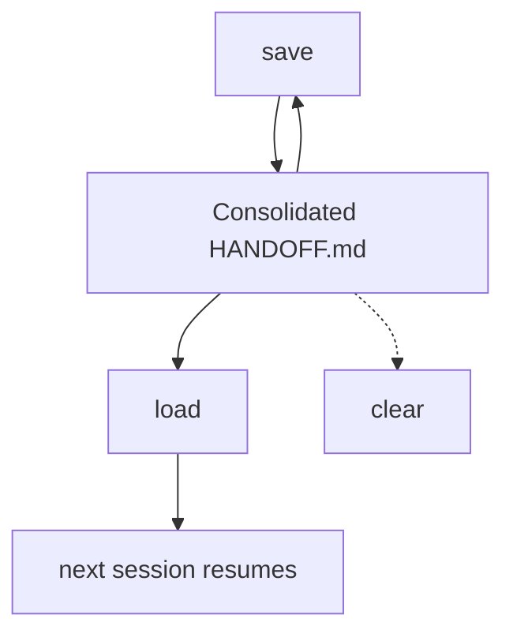

# Handoff

Capture conversation state so another session can resume.

## What It Does



| Operation | Output |
|-----------|--------|
| save | Consolidates the existing handoff with the current conversation and work state |
| load | Reads the handoff, checks claims that may have changed, and resumes from its context |
| clear | Writes empty content to the file (opt-in, separate operation) |

## Usage

```text
save context
dump conversation
checkpoint this
session handoff
save handoff
resume session
load handoff
continue from last
clear handoff
reset handoff
/handoff
/handoff continue auth race fix
/handoff load
/handoff clear
```

## Output

```text
.artifacts/HANDOFF.md      # one current, consolidated handoff
```

Save consolidates it on each run and clear empties it. An empty file reads as no handoff.

## Requirements

Python 3 (standard library only) for the format and secret check save runs on the written file.

## FAQ

**Q: Does save discard the previous handoff?** A: No. Save reads the existing handoff and consolidates it with the current conversation. Relevant information remains; superseded and redundant content is removed.

**Q: Does load auto-clear the handoff?** A: No. Load reads the handoff; clear is a separate explicit operation.

**Q: Does the handoff prescribe what to do next?** A: No. The next session infers what to do from the focus, context, and current state.

**Q: What if the file is absent?** A: Load reports that no handoff exists. Clear no-ops silently. Save creates the file.

**Q: How does this differ from end-of-session note persistence?** A: End-of-session flows write a narrative of what happened into a durable memory system. The handoff skill carries the live focus, rationale, and work state needed to resume. An end-of-session flow may consume and clear the handoff after it persists the content.

**Q: Can I describe what the next session should focus on?** A: Yes. Pass the focus as an argument: `/handoff continue auth race fix`. Save tailors `Focus`, `Context`, and `Current state` to that focus. Without an argument, save captures the current focus from the conversation. `load` and `clear` are the only arguments that select another operation.
