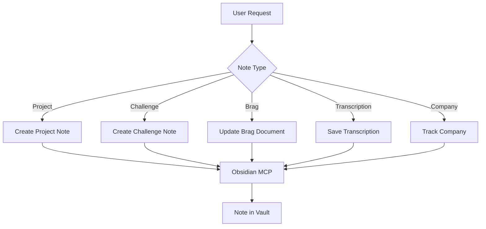

# Notes

Structured note creation for Obsidian using the Obsidian MCP.

## What It Does



| Note Type | Output |
|-----------|--------|
| Project | Full project documentation (overview, goals, architecture) in `<obsidian.path>/<Project Name>/<Project Name> Overview.md` |
| Challenge | Technical interview challenge (take-home, system design) in `Challenges/<Company>/<Type Topic>.md` |
| Brag | Achievement tracking for performance reviews in `Brags/YYYY.md` or `Brags/YYYY Qn.md` |
| Transcription | Meeting, 1:1, feedback session, lecture, or course in `Meetings/<Description>.md` or `Courses/<Description>.md` |
| Company | Job application tracking (timeline, status, decision) in `Companies/<Company>/<Role> — <Company>.md` |

## Usage

```text
create project note for checkout-refactor
record technical challenge from Stripe interview
add brag: reduced latency by 40%
save transcription from yesterday's 1:1
track company application — Stripe Senior Frontend
```

## Output

Notes are created in the Obsidian vault following this structure:

```text
Vault/
├── <obsidian.path>/
│   └── <Project Name>/
│       └── <Project Name> Overview.md
├── Challenges/
├── Brags/
├── Meetings/
├── Courses/
└── Companies/
```

## Requirements

- Obsidian MCP server configured and connected
- Python 3, standard library only, for the bundled scripts
- An Obsidian vault served by the Obsidian MCP server. On the first project note in a repo the skill creates the registry at `~/.config/wrap-up/projects.yml` when absent and asks for the project entry.

## FAQ

**Q: How do filenames handle special characters?** A: Characters the OS rejects or Obsidian links break on (`/ \ : * ? " < > | # ^ [ ] %`) are removed. Accented characters are kept. All filenames are Title Case.

**Q: What if a note with the same name exists?** A: The skill detects duplicates via `Obsidian:search_notes` and asks whether to append, choose a new name, or cancel.

**Q: Can the skill update existing notes?** A: Yes. `Obsidian:read_note` + `Obsidian:patch_note` updates existing notes in place. Templates apply only to new note creation.

**Q: How are wikilinks validated?** A: Before adding a wikilink, the skill verifies the target file exists. Orphan wikilinks (pointing to missing files) create empty files at the vault root and are avoided.
