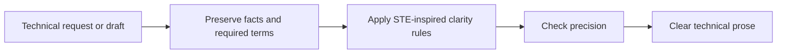

# Plain Spoken

Makes technical prose easier to understand without removing necessary precision.

## What It Does



| Mode | Output |
| ---- | ------ |
| Write | A new technical answer in clear language, with requirements, code, identifiers, and domain terms kept accurate |
| Rewrite | The supplied text simplified without changing its technical meaning, returned alone |
| Audit | A verdict and the clarity defects found, followed by the rewritten text |

## Usage

```text
explain this architecture in plain technical English
rewrite this runbook with less jargon
make this API error explanation easier for a global team to understand
use an ASD-STE100 style for this maintenance procedure
audit this technical note for complex words and ambiguous sentences
```

## Requirements

Python 3, standard library only, for the bundled script.

Formal ASD-STE100 conformance requires the official standard and the approved terminology for the applicable company, industry, or subject field. Without both sources, the skill labels the result as best effort rather than compliant.

## FAQ

**Q: Does the agent use it without being asked?** A: Yes. The agent can select it automatically for technical prose written for people, including brief factual answers, explanations, runbooks, specifications, incident reports, architecture notes, procedures, and documentation. One-word confirmations, code-only output, and raw logs remain unchanged.

**Q: What does it return?** A: The improved text only, by default. An audit request returns findings and a rewritten version.

**Q: Does it follow ASD-STE100?** A: It adapts principles from [ASD-STE100 Simplified Technical English](https://www.asd-ste100.org/) to agent responses. It does not reproduce the controlled dictionary or claim formal compliance.

**Q: Does it remove every technical term?** A: No. It keeps terms that carry necessary meaning and defines unfamiliar terms when the reader needs the definition.

**Q: Does it work for Portuguese output?** A: Yes. The structural rules and the word-choice test apply the same way in any language. The controlled dictionary is English; in another language, apply the same test to the equivalent word pair. Only English text can be called Simplified Technical English, because formal conformance is defined for English.

**Q: Does simple mean childish?** A: No. The target is direct, precise language for readers with different levels of proficiency in the language of the text.
